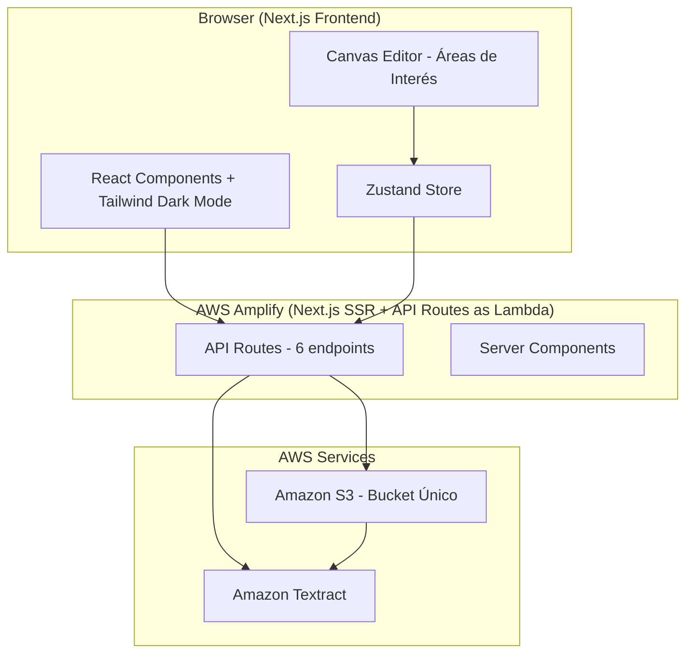
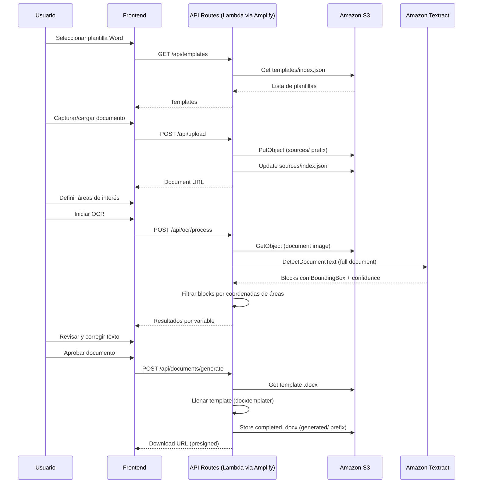
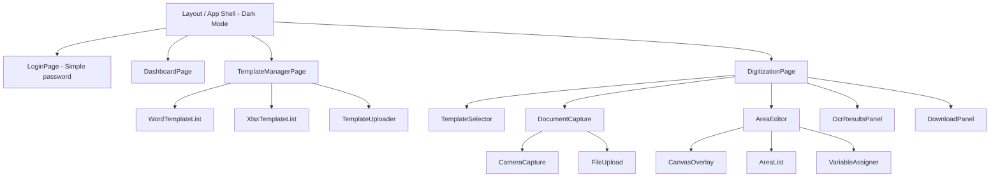

# Design Document: Document Digitization (MVP Hackathon)

## Overview

Aplicación web MVP para la digitalización de documentos físicos utilizados en eventos deportivos. El sistema permite escanear/cargar documentos, definir áreas de interés, extraer texto mediante OCR (Amazon Textract), y generar documentos Word (.docx) completados con la información extraída. Opcionalmente registra datos en plantillas Excel (.xlsx).

Arquitectura simplificada para hackathon: **Usuario → AWS Amplify (Next.js) → S3 + Textract**. Solo 3 servicios AWS.

### Key Design Decisions

| Decision | Choice | Rationale |
|----------|--------|-----------|
| Framework | Next.js 14 (App Router) | Full-stack React con SSR + API Routes desplegados automáticamente como Lambda por Amplify |
| Deploy | AWS Amplify | Hosting automático con SSR, API Routes como Lambda, CI/CD integrado |
| OCR Engine | Amazon Textract (DetectDocumentText) | Full-document strategy con BoundingBox filtering. Una sola llamada API por documento |
| Template Engine | docxtemplater | Librería madura para llenar plantillas .docx con `{{placeholder}}` |
| Excel | ExcelJS | Lectura/escritura .xlsx, extracción de headers, append de filas |
| Storage | Amazon S3 (bucket único) | Almacena plantillas, documentos fuente, configuraciones (JSON), y archivos generados |
| Metadata | JSON files en S3 | Sin DynamoDB. Archivos `index.json` por prefijo para listar recursos |
| Auth | Variable de entorno (demo) | Password simple en `process.env.DEMO_PASSWORD` para hackathon single-user |
| Styling | Tailwind CSS (dark mode) | Purple primary (#a855f7), mobile-first, accesibilidad AA |
| State | Zustand | Ligero, sin boilerplate para estado cliente |
| PDF | Omitido en MVP | Solo descarga .docx. Usuario puede "Guardar como PDF" desde Word/navegador |

---

## Architecture

### High-Level Architecture Diagram



### Request Flow: Document Digitization Process



### Deployment Architecture

- **AWS Amplify**: Hospeda Next.js con SSR. Los API Routes se despliegan automáticamente como funciones Lambda.
- **S3 Bucket**: Un solo bucket con prefijos planos (sin aislamiento por usuario — demo single-user).
- **Textract**: Invocado directamente desde API Routes via AWS SDK v3.
- **Sin DynamoDB**: Metadata almacenada como archivos JSON en S3.
- **Sin Lambda separado**: No hay función Lambda adicional para PDF. Solo .docx download.

### AWS Service Constraints

| Service | Constraint | Impact |
|---------|-----------|--------|
| Textract (sync) | Max 10MB por documento, 1 página para PDF/TIFF | Documentos fuente deben ser single-page (PNG/JPG preferido) |
| Textract (sync) | Formatos: JPEG, PNG, PDF, TIFF | Alineado con formatos aceptados |
| Textract | Handwriting: solo inglés | Texto manuscrito en español puede tener precisión reducida. Caracteres impresos (ñ, á, é) soportados. |
| Textract | Min character height: 15px (8pt at 150 DPI) | Escanear a ≥150 DPI para detección confiable |
| Textract | Confidence por WORD block | Confidence por área = min(confidence) de todos los WORD blocks dentro del área |
| S3 | Presigned URLs | URLs con expiración por defecto (15 min para upload, 1 hora para download) |
| Amplify Lambda | Max payload 6MB | Archivos grandes se manejan pasando S3 keys, no bytes directos |

### OCR Processing Strategy

El sistema usa un enfoque **full-document, single-call**:

1. La imagen completa del Documento_Fuente se envía a Textract `DetectDocumentText`
2. Textract retorna todos los blocks (PAGE, LINE, WORD) con BoundingBox normalizado (0–1)
3. El API filtra WORD blocks cuyo BoundingBox se solapa con cada Area_de_Interes
4. Para cada área, las palabras se concatenan en orden de lectura (top-to-bottom, left-to-right)
5. Confidence por área = `min(confidence)` de todos los WORD blocks dentro del área
6. Si no hay words en un área, resultado vacío con confidence 0%

**Ventajas sobre cropping por área:**
- Una sola llamada Textract independiente del número de áreas (menor costo y latencia)
- No requiere manipulación de imagen server-side
- Las coordenadas BoundingBox de Textract ya son normalizadas (0–1)

---

## Components and Interfaces

### Frontend Components



### Core Component Interfaces

```typescript
// --- Template Management ---
interface TemplateUploaderProps {
  type: 'word' | 'xlsx';
  onUploadComplete: (template: TemplateMetadata) => void;
  maxSizeMb: number; // 25
}

// --- Document Capture ---
interface DocumentCaptureProps {
  onDocumentReady: (documentUrl: string, s3Key: string) => void;
  onRetake: () => void;
}

interface CameraCaptureProps {
  onCapture: (imageBlob: Blob) => void;
  onError: (error: string) => void;
}

// --- Area Editor ---
interface AreaEditorProps {
  documentUrl: string;
  availableVariables: Variable[];
  existingAreas: AreaOfInterest[];
  onAreasChange: (areas: AreaOfInterest[]) => void;
  onSaveConfiguration: (config: SegmentationConfig) => void;
}

interface CanvasOverlayProps {
  imageUrl: string;
  areas: AreaOfInterest[];
  selectedAreaId: string | null;
  onAreaCreated: (area: Omit<AreaOfInterest, 'id' | 'variableName'>) => void;
  onAreaUpdated: (id: string, updates: Partial<AreaOfInterest>) => void;
  onAreaDeleted: (id: string) => void;
  onAreaSelected: (id: string | null) => void;
}

// --- OCR Results ---
interface OcrResultsPanelProps {
  results: OcrResult[];
  onFieldEdit: (variableName: string, newValue: string) => void;
  onApprove: () => void;
}
```

### API Routes (6 endpoints totales)

| Method | Route | Description |
|--------|-------|-------------|
| POST | `/api/auth/login` | Verificar password contra env var |
| GET | `/api/templates` | Listar todas las plantillas (Word + XLSX) |
| POST | `/api/upload` | Subir archivo (template o source) a S3 |
| DELETE | `/api/templates/[id]` | Eliminar plantilla |
| POST | `/api/ocr/process` | Procesar OCR en áreas definidas |
| POST | `/api/documents/generate` | Generar .docx completado (y XLSX si aplica) |

### Backend Service Layer

```typescript
// --- Template Service ---
interface TemplateService {
  uploadTemplate(file: Buffer, fileName: string, type: 'word' | 'xlsx'): Promise<TemplateMetadata>;
  extractPlaceholders(docxBuffer: Buffer): Promise<string[]>;
  extractXlsxHeaders(xlsxBuffer: Buffer): Promise<string[]>;
  validateDocxStructure(buffer: Buffer): Promise<boolean>;
  validateXlsxStructure(buffer: Buffer): Promise<boolean>;
  deleteTemplate(id: string): Promise<void>;
  listTemplates(type?: 'word' | 'xlsx'): Promise<TemplateMetadata[]>;
}

// --- OCR Service ---
interface OcrService {
  processDocument(
    documentKey: string,
    areas: AreaOfInterest[]
  ): Promise<OcrResult[]>;
  detectText(imageBytes: Buffer): Promise<TextractBlock[]>;
  filterBlocksByArea(blocks: TextractBlock[], area: AreaOfInterest): TextractBlock[];
  calculateAreaConfidence(blocks: TextractBlock[]): number;
}

interface TextractBlock {
  blockType: 'PAGE' | 'LINE' | 'WORD';
  text?: string;
  confidence: number;
  boundingBox: { width: number; height: number; left: number; top: number };
}

// --- Document Generation Service ---
interface DocumentGenerationService {
  fillWordTemplate(templateKey: string, variables: Record<string, string>): Promise<Buffer>;
  fillXlsxTemplate(templateKey: string, variables: Record<string, string>): Promise<Buffer>;
}

// --- Configuration Service ---
interface ConfigurationService {
  saveConfiguration(config: SegmentationConfig): Promise<void>;
  loadConfiguration(templateId: string, configName: string): Promise<SegmentationConfig>;
  listConfigurations(templateId?: string): Promise<SegmentationConfigMeta[]>;
  deleteConfiguration(templateId: string, configName: string): Promise<void>;
}

// --- Storage Service (S3 wrapper) ---
interface StorageService {
  putObject(key: string, body: Buffer, contentType: string): Promise<void>;
  getObject(key: string): Promise<Buffer>;
  deleteObject(key: string): Promise<void>;
  getPresignedDownloadUrl(key: string, expiresInSeconds?: number): Promise<string>;
  getJsonIndex(prefix: string): Promise<any[]>;
  updateJsonIndex(prefix: string, entries: any[]): Promise<void>;
}
```

---

## Data Models

### S3 Bucket Structure (Flat Prefixes)

```
s3://document-digitization-hackathon/
├── templates/
│   ├── index.json                    # Lista de todas las plantillas
│   ├── word/{templateId}.docx        # Plantillas Word
│   └── xlsx/{templateId}.xlsx        # Plantillas Excel
├── sources/
│   ├── index.json                    # Lista de documentos fuente
│   └── {documentId}.(png|jpg|pdf)    # Documentos escaneados/cargados
├── generated/
│   ├── index.json                    # Lista de documentos generados
│   ├── {documentId}.docx             # Documentos Word completados
│   └── {documentId}.xlsx             # Excel completados
└── configs/
    ├── index.json                    # Lista de configuraciones
    └── {templateId}/{configName}.json # Configuraciones de segmentación
```

### JSON Index Files (reemplazan DynamoDB)

```typescript
// templates/index.json
interface TemplateIndex {
  templates: TemplateMetadata[];
}

interface TemplateMetadata {
  id: string;           // UUID
  type: 'word' | 'xlsx';
  fileName: string;
  s3Key: string;
  fileSize: number;
  placeholders: string[];  // Variables detectadas
  uploadDate: string;      // ISO timestamp
}

// configs/index.json
interface ConfigIndex {
  configurations: SegmentationConfigMeta[];
}

interface SegmentationConfigMeta {
  templateId: string;
  configName: string;
  areaCount: number;
  lastModified: string;
}
```

### TypeScript Interfaces (Core Domain)

```typescript
interface AreaOfInterest {
  id: string;
  x: number;        // porcentaje (0–1) relativo al ancho del documento
  y: number;        // porcentaje (0–1) relativo al alto del documento
  width: number;    // porcentaje (0–1)
  height: number;   // porcentaje (0–1)
  variableName: string;
  color: string;    // color único para distinción visual
}

interface OcrResult {
  variableName: string;
  extractedText: string;
  confidence: number; // 0–100, min(confidence) de todos los WORD blocks en el área
  wordCount: number;
}

interface SegmentationConfig {
  templateId: string;
  configName: string;
  areas: AreaOfInterest[];
  lastModified: string;
}

interface Variable {
  name: string;
  source: 'word' | 'xlsx' | 'both';
  assigned: boolean;
}

interface GeneratedDocument {
  id: string;
  templateId: string;
  sourceDocumentKey: string;
  generatedDocxKey: string;
  generatedXlsxKey?: string;
  variables: Record<string, string>;
  confidenceScores: Record<string, number>;
  createdAt: string;
}
```

---

## Correctness Properties

*A property is a characteristic or behavior that should hold true across all valid executions of a system—essentially, a formal statement about what the system should do. Properties serve as the bridge between human-readable specifications and machine-verifiable correctness guarantees.*

### Property 1: File format validation

*For any* file submitted for upload, the system SHALL accept the file if and only if its extension matches the expected format for the target type (`.docx` for Word templates, `.xlsx` for Excel templates, `.pdf`/`.png`/`.jpg` for source documents); all other extensions SHALL be rejected with the appropriate error message in Spanish.

**Validates: Requirements 2.2, 3.2, 4.7, 4.13**

### Property 2: File size validation

*For any* file submitted for upload, the system SHALL accept the file if and only if its size is less than or equal to 25MB (26,214,400 bytes); files exceeding this limit SHALL be rejected.

**Validates: Requirements 2.10, 3.9**

### Property 3: Word template placeholder extraction (round-trip)

*For any* valid .docx document containing zero or more strings matching the pattern `{{[a-zA-Z0-9_]+}}`, the placeholder extraction function SHALL return exactly the set of variable names (without braces) found in the document, with no duplicates and no missed occurrences.

**Validates: Requirements 2.7**

### Property 4: XLSX header extraction

*For any* valid .xlsx file, the header extraction function SHALL return all non-empty cell values from the first row in column order, producing an empty list if and only if all first-row cells are empty.

**Validates: Requirements 3.3, 3.4**

### Property 5: Variable name format validation with priority ordering

*For any* string submitted as a Variable_de_Extraccion name, the system SHALL validate in this exact order: (1) format—only alphanumeric characters and underscores, (2) length—between 1 and 50 characters, (3) template match—exists in Word placeholders or XLSX headers. The system SHALL report the error for the first failed check only.

**Validates: Requirements 5.3, 5.11**

### Property 6: Variable-to-template matching (case-sensitive)

*For any* variable name and any set of template placeholders/headers, the match function SHALL return true if and only if an exact case-sensitive string comparison finds the variable name in the set; partial matches or case-insensitive matches SHALL not count.

**Validates: Requirements 5.4, 10.1**

### Property 7: Variable uniqueness per document

*For any* set of Area_de_Interes definitions within a single digitization process, no two areas SHALL have the same Variable_de_Extraccion name. Attempting to assign a duplicate name SHALL be rejected.

**Validates: Requirements 5.6**

### Property 8: Coordinate percentage conversion

*For any* Area_de_Interes defined with pixel coordinates (x, y, width, height) on a document of known dimensions (docWidth, docHeight), the stored configuration SHALL represent coordinates as percentages where storedX = x/docWidth, storedY = y/docHeight, storedWidth = width/docWidth, storedHeight = height/docHeight, all values in the range [0, 1].

**Validates: Requirements 6.2**

### Property 9: BoundingBox overlap detection

*For any* WORD block returned by Textract with BoundingBox (left, top, width, height) and any Area_de_Interes with normalized coordinates, the filtering function SHALL include the block if and only if: block.left < area.x + area.width AND block.left + block.width > area.x AND block.top < area.y + area.height AND block.top + block.height > area.y.

**Validates: Requirements 7.1**

### Property 10: OCR confidence severity classification

*For any* OCR result with a confidence score, the system SHALL classify it as: (a) critical (red border) if confidence equals 0% or text is empty, (b) warning (yellow indicator) if confidence is above 0% but below 80%, (c) normal (no indicator) if confidence is 80% or above.

**Validates: Requirements 7.6, 8.3, 8.9**

### Property 11: Download filename generation

*For any* template name and generation date, the download filename SHALL be constructed as `{templateName}_{YYYY-MM-DD}.docx`, where the date uses the ISO format of the generation timestamp.

**Validates: Requirements 9.4, 9.5**

### Property 12: XLSX row appending without overwrite

*For any* sequence of document digitizations using the same Plantilla_XLSX, each new set of extracted data SHALL be appended as a new row after the last existing data row. The row count SHALL equal the header row plus the number of completed digitizations, and no previously inserted data SHALL be modified.

**Validates: Requirements 10.2, 10.8**

### Property 13: Area minimum size validation

*For any* drawn rectangle, the system SHALL create an Area_de_Interes if and only if both its width and height are at least 10 pixels; rectangles smaller than 10×10 SHALL be rejected.

**Validates: Requirements 5.2**

---

## Error Handling

### Error Strategy (Simplified for MVP)

Simple try/catch con mensajes en español directamente al usuario via toast notifications. Sin retry automático — solo botones de reintentar manuales.

```typescript
interface ApiErrorResponse {
  error: {
    code: string;
    message: string;      // Siempre en español
    retryable: boolean;
  };
}
```

### Error Codes

| Code | HTTP Status | Mensaje en Español |
|------|-------------|-------------------|
| `AUTH_INVALID` | 401 | "Contraseña incorrecta" |
| `FILE_FORMAT_INVALID` | 400 | "Formato no soportado. Solo se permiten archivos {formats}" |
| `FILE_TOO_LARGE` | 400 | "El archivo excede el tamaño máximo permitido de 25MB" |
| `FILE_CORRUPT` | 400 | "El archivo está dañado o no es un documento válido" |
| `UPLOAD_FAILED` | 503 | "Error al cargar el archivo. Verifique su conexión e intente nuevamente" |
| `OCR_FAILED` | 502 | "Error en el procesamiento OCR. Verifique la calidad del documento e intente nuevamente" |
| `OCR_TIMEOUT` | 504 | "El procesamiento OCR tardó demasiado. Intente nuevamente" |
| `GENERATION_FAILED` | 502 | "Error al generar el documento. Intente nuevamente" |
| `XLSX_FAILED` | 502 | "Error al completar la plantilla Excel. Intente nuevamente" |
| `STORAGE_FAILED` | 503 | "Error al almacenar el archivo. Intente nuevamente" |
| `CONFIG_SAVE_FAILED` | 503 | "Error al guardar la configuración. Intente nuevamente" |
| `VARIABLE_DUPLICATE` | 400 | "La variable '[nombre]' ya está asignada a otra área" |
| `VARIABLE_NO_MATCH` | 400 | "El nombre '[nombre]' no coincide con ninguna variable en las plantillas" |
| `NO_PLACEHOLDERS` | 200 | "No se detectaron variables (placeholders) en esta plantilla" |
| `CAMERA_UNAVAILABLE` | 200 | "No se detectó cámara. Puede cargar un documento escaneado manualmente" |
| `EMPTY_FIELDS` | 400 | "Existen campos vacíos o inválidos. Revise los campos marcados antes de aprobar" |

### State Preservation on Error

- **File selection**: preservada cuando falla upload (no re-seleccionar)
- **Area definitions**: preservadas en Zustand store cuando falla guardado de config
- **Edited field values**: preservados en Zustand cuando falla generación
- **Auto-save**: áreas guardadas en localStorage como respaldo

---

## Testing Strategy

### Testing Approach

Dual approach: property-based tests para correctness universal + unit tests para escenarios específicos. Simplificado para MVP — sin tests de DynamoDB, auth complejo, o PDF.

### Property-Based Testing

**Library**: [fast-check](https://github.com/dubzzz/fast-check)

**Configuration**:
- Minimum 100 iterations per property test
- Tag: `Feature: document-digitization, Property {N}: {description}`
- Run via: `vitest --run`

**Properties to implement** (13 properties):

| Property | Test File | Key Generator |
|----------|-----------|---------------|
| 1: File format validation | `validation.property.test.ts` | `fc.record({ extension: fc.string(), targetType: fc.constantFrom('word','xlsx','source') })` |
| 2: File size validation | `validation.property.test.ts` | `fc.nat({ max: 50_000_000 })` |
| 3: Placeholder extraction | `template.property.test.ts` | Custom .docx content with embedded `{{var}}` patterns |
| 4: XLSX header extraction | `template.property.test.ts` | `fc.array(fc.option(fc.string({ minLength: 1 })))` |
| 5: Variable name validation | `validation.property.test.ts` | `fc.string()` with various character sets |
| 6: Variable-to-template match | `validation.property.test.ts` | `fc.record({ name: fc.string(), set: fc.array(fc.string()) })` |
| 7: Variable uniqueness | `area-editor.property.test.ts` | `fc.array(fc.string({ minLength: 1 }))` |
| 8: Coordinate conversion | `configuration.property.test.ts` | `fc.record({ x: fc.nat(), y: fc.nat(), w: fc.nat(), h: fc.nat(), docW: fc.integer({min:1}), docH: fc.integer({min:1}) })` |
| 9: BoundingBox overlap | `ocr.property.test.ts` | Two bounding boxes with random normalized coords |
| 10: Confidence classification | `ocr.property.test.ts` | `fc.integer({ min: 0, max: 100 })` |
| 11: Filename generation | `document.property.test.ts` | `fc.record({ templateName: fc.string(), date: fc.date() })` |
| 12: XLSX row appending | `xlsx.property.test.ts` | `fc.array(fc.record({ vars: fc.dictionary(fc.string(), fc.string()) }))` |
| 13: Area minimum size | `area-editor.property.test.ts` | `fc.record({ width: fc.nat({ max: 500 }), height: fc.nat({ max: 500 }) })` |

### Unit Tests (Example-Based)

| Area | Focus | Framework |
|------|-------|-----------|
| Template management | Upload flow, duplicate name handling | Vitest |
| Document capture | Camera fallback, file format acceptance | Vitest + React Testing Library |
| Area editor | Drawing interaction, resize/delete | Vitest + React Testing Library |
| OCR results | Field display, confidence indicators, empty results | Vitest + React Testing Library |
| Document generation | docxtemplater fill, XLSX append | Vitest |

### Integration Tests

| Area | Focus | Framework |
|------|-------|-----------|
| S3 Operations | Upload, download, JSON index CRUD | Vitest + aws-sdk-mock |
| Textract | Document processing with sample images | Vitest + aws-sdk-mock |
| End-to-End Flow | Full digitization pipeline | Playwright |

### Test Organization

```
tests/
├── property/               # Property-based tests (fast-check)
│   ├── validation.property.test.ts
│   ├── template.property.test.ts
│   ├── area-editor.property.test.ts
│   ├── configuration.property.test.ts
│   ├── ocr.property.test.ts
│   ├── document.property.test.ts
│   └── xlsx.property.test.ts
├── unit/                   # Example-based unit tests
│   ├── components/
│   ├── services/
│   └── utils/
├── integration/            # Integration tests
│   ├── s3.integration.test.ts
│   └── textract.integration.test.ts
└── e2e/                    # End-to-end (Playwright)
    └── digitization-flow.spec.ts
```
