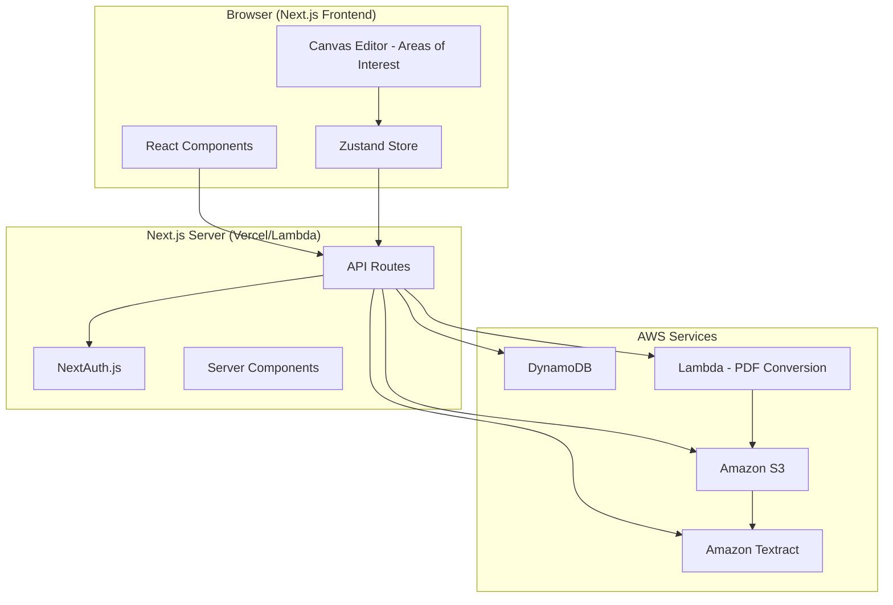
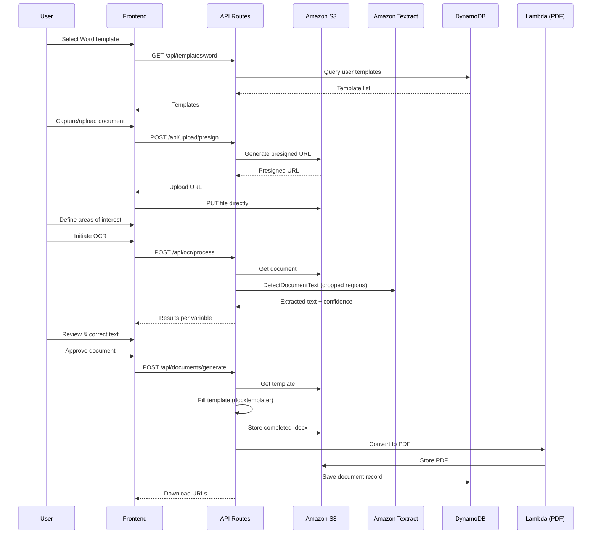
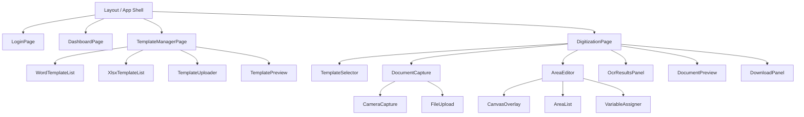

# Design Document: Document Digitization

## Overview

This design describes a web application for digitizing physical documents used in sporting events. The system enables coordinators to scan or upload paper documents, define areas of interest, extract text via OCR (Amazon Textract), and produce clean digital documents by filling Word (.docx) templates with the extracted data. Optionally, extracted data can also be registered in Excel (.xlsx) templates.

The application follows a **Next.js 14 App Router** architecture with a serverless backend using **API Routes**, **Amazon S3** for file storage, and **Amazon Textract** for OCR. The frontend uses **React 18** with **Tailwind CSS** in dark mode with a purple primary palette (`#a855f7`).

### Key Design Decisions

| Decision | Choice | Rationale |
|----------|--------|-----------|
| Framework | Next.js 14 (App Router) | Full-stack React with serverless API routes, SSR, mobile-first support |
| OCR Engine | Amazon Textract (DetectDocumentText) | Handles printed and handwritten text, returns bounding boxes and confidence scores |
| Template Engine | docxtemplater | Mature library supporting `{{placeholder}}` syntax natively for .docx |
| Excel Handling | ExcelJS | Read/write .xlsx with cell-level control, header extraction, row appending |
| PDF Conversion | libreoffice-convert (Lambda layer) | Reliable .docx → PDF via LibreOffice headless in AWS Lambda |
| File Storage | Amazon S3 + presigned URLs | Direct browser-to-S3 upload, avoids 4.5MB Lambda payload limit |
| Authentication | NextAuth.js with credentials provider | Session-based auth with configurable inactivity timeout |
| Database | Amazon DynamoDB | Serverless, pay-per-request, ideal for file metadata and user records |
| Styling | Tailwind CSS | Utility-first, dark mode native, responsive with mobile-first approach |
| State Management | Zustand | Lightweight, minimal boilerplate for client-side state |

---

## Architecture

### High-Level Architecture Diagram



### Request Flow: Document Digitization Process



### Deployment Architecture

- **Frontend + API Routes**: Deployed on Vercel (or AWS Amplify) with edge functions
- **S3 Bucket**: Single bucket with prefix-based organization per user
- **DynamoDB**: On-demand capacity for metadata storage
- **Lambda (PDF)**: Separate Lambda function with LibreOffice layer for .docx → PDF conversion
- **Textract**: Invoked via AWS SDK from API routes

---

## Components and Interfaces

### Frontend Components



### Core Component Interfaces

```typescript
// --- Template Management ---
interface TemplateUploaderProps {
  type: 'word' | 'xlsx';
  onUploadComplete: (template: TemplateMetadata) => void;
  maxSizeMb: number; // 25
}

interface TemplatePreviewProps {
  template: TemplateMetadata;
  onClose: () => void;
}

// --- Document Capture ---
interface DocumentCaptureProps {
  onDocumentReady: (documentUrl: string, documentId: string) => void;
  onRetake: () => void;
}

interface CameraCaptureProps {
  onCapture: (imageBlob: Blob) => void;
  onError: (error: CameraError) => void;
}

// --- Area Editor ---
interface AreaEditorProps {
  documentUrl: string;
  availableVariables: Variable[];
  existingAreas: AreaOfInterest[];
  onAreasChange: (areas: AreaOfInterest[]) => void;
  onSaveConfiguration: (config: SegmentationConfig) => void;
}

interface CanvasOverlayProps {
  imageUrl: string;
  areas: AreaOfInterest[];
  selectedAreaId: string | null;
  onAreaCreated: (area: Omit<AreaOfInterest, 'id' | 'variableName'>) => void;
  onAreaUpdated: (id: string, updates: Partial<AreaOfInterest>) => void;
  onAreaDeleted: (id: string) => void;
  onAreaSelected: (id: string | null) => void;
}

// --- OCR Results ---
interface OcrResultsPanelProps {
  results: OcrResult[];
  onFieldEdit: (variableName: string, newValue: string) => void;
  onApprove: () => void;
}

// --- Document Preview ---
interface DocumentPreviewProps {
  sourceDocumentUrl: string;
  generatedDocumentUrl: string;
  highlightedVariable: string | null;
  areas: AreaOfInterest[];
  onVariableClick: (variableName: string) => void;
}
```

### API Routes

| Method | Route | Description |
|--------|-------|-------------|
| POST | `/api/auth/login` | Authenticate user |
| POST | `/api/auth/logout` | Terminate session |
| GET | `/api/auth/session` | Get current session |
| POST | `/api/auth/extend` | Extend session |
| GET | `/api/templates/word` | List Word templates |
| POST | `/api/templates/word` | Upload Word template |
| DELETE | `/api/templates/word/[id]` | Delete Word template |
| GET | `/api/templates/word/[id]/preview` | Preview template |
| GET | `/api/templates/xlsx` | List XLSX templates |
| POST | `/api/templates/xlsx` | Upload XLSX template |
| DELETE | `/api/templates/xlsx/[id]` | Delete XLSX template |
| POST | `/api/upload/presign` | Generate presigned upload URL |
| POST | `/api/documents/source` | Register source document |
| POST | `/api/ocr/process` | Process OCR on areas |
| POST | `/api/documents/generate` | Generate completed document |
| POST | `/api/documents/pdf` | Convert .docx to PDF |
| GET | `/api/documents/[id]/download` | Download generated document |
| GET | `/api/configurations` | List segmentation configs |
| POST | `/api/configurations` | Save segmentation config |
| PUT | `/api/configurations/[id]` | Update config |
| DELETE | `/api/configurations/[id]` | Delete config |
| GET | `/api/files/history` | Get file history (paginated) |

### Backend Service Layer

```typescript
// --- Template Service ---
interface TemplateService {
  uploadWordTemplate(file: Buffer, fileName: string, userId: string): Promise<TemplateMetadata>;
  uploadXlsxTemplate(file: Buffer, fileName: string, userId: string): Promise<TemplateMetadata>;
  extractPlaceholders(docxBuffer: Buffer): Promise<string[]>;
  extractXlsxHeaders(xlsxBuffer: Buffer): Promise<string[]>;
  validateDocxStructure(buffer: Buffer): Promise<boolean>;
  validateXlsxStructure(buffer: Buffer): Promise<boolean>;
  deleteTemplate(id: string, userId: string): Promise<void>;
  listTemplates(userId: string, type: 'word' | 'xlsx'): Promise<TemplateMetadata[]>;
}

// --- OCR Service ---
interface OcrService {
  processAreas(
    documentKey: string,
    areas: AreaOfInterest[],
    documentDimensions: { width: number; height: number }
  ): Promise<OcrResult[]>;
  cropImageToArea(imageBuffer: Buffer, area: AreaOfInterest, dimensions: Dimensions): Promise<Buffer>;
}

// --- Document Generation Service ---
interface DocumentGenerationService {
  fillWordTemplate(templateKey: string, variables: Record<string, string>): Promise<Buffer>;
  fillXlsxTemplate(templateKey: string, variables: Record<string, string>, userId: string): Promise<Buffer>;
  convertToPdf(docxBuffer: Buffer): Promise<Buffer>;
}

// --- Configuration Service ---
interface ConfigurationService {
  saveConfiguration(config: SegmentationConfig, userId: string): Promise<string>;
  loadConfiguration(configId: string): Promise<SegmentationConfig>;
  listConfigurations(userId: string, templateId?: string): Promise<SegmentationConfigMeta[]>;
  deleteConfiguration(configId: string, userId: string): Promise<void>;
}

// --- Storage Service ---
interface StorageService {
  generatePresignedUploadUrl(key: string, contentType: string, maxSizeBytes: number): Promise<string>;
  generatePresignedDownloadUrl(key: string, expiresIn?: number): Promise<string>;
  getObject(key: string): Promise<Buffer>;
  putObject(key: string, body: Buffer, contentType: string): Promise<void>;
  deleteObject(key: string): Promise<void>;
}
```

---

## Data Models

### DynamoDB Tables

#### Users Table

| Attribute | Type | Key | Description |
|-----------|------|-----|-------------|
| userId | String | PK | Unique user identifier (UUID) |
| email | String | GSI-PK | User email (unique) |
| passwordHash | String | — | bcrypt hashed password |
| failedAttempts | Number | — | Consecutive failed login attempts |
| lockedUntil | String | — | ISO timestamp for account lock expiry |
| createdAt | String | — | ISO timestamp |
| updatedAt | String | — | ISO timestamp |

#### Templates Table

| Attribute | Type | Key | Description |
|-----------|------|-----|-------------|
| templateId | String | PK | Unique template identifier (UUID) |
| userId | String | GSI-PK | Owner user |
| type | String | GSI-SK | 'word' or 'xlsx' |
| fileName | String | — | Original file name |
| s3Key | String | — | S3 object key |
| fileSize | Number | — | File size in bytes |
| placeholders | List<String> | — | Extracted placeholder/header names |
| uploadDate | String | — | ISO timestamp |
| status | String | — | 'stored' / 'processing' / 'error' |

#### Documents Table

| Attribute | Type | Key | Description |
|-----------|------|-----|-------------|
| documentId | String | PK | Unique document identifier (UUID) |
| userId | String | GSI-PK | Owner user |
| type | String | — | 'source' / 'generated' |
| s3Key | String | — | S3 object key |
| fileName | String | — | File name |
| scanDate | String | — | ISO timestamp |
| wordTemplateId | String | — | Associated Word template |
| xlsxTemplateId | String | — | Associated XLSX template (optional) |
| ocrResults | Map | — | Variable → extracted text map |
| confidenceScores | Map | — | Variable → confidence percentage |
| status | String | — | 'stored' / 'processing' / 'error' |
| generatedPdfKey | String | — | S3 key for PDF output |
| generatedDocxKey | String | — | S3 key for completed .docx |
| createdAt | String | — | ISO timestamp |

#### Configurations Table

| Attribute | Type | Key | Description |
|-----------|------|-----|-------------|
| configId | String | PK | Unique configuration identifier |
| userId | String | GSI-PK | Owner user |
| templateId | String | GSI-SK | Associated Word template |
| name | String | — | Configuration display name |
| areas | List<Map> | — | Array of area definitions |
| areas[].x | Number | — | X position (percentage 0–1) |
| areas[].y | Number | — | Y position (percentage 0–1) |
| areas[].width | Number | — | Width (percentage 0–1) |
| areas[].height | Number | — | Height (percentage 0–1) |
| areas[].variableName | String | — | Variable_de_Extraccion name |
| lastModified | String | — | ISO timestamp |
| createdAt | String | — | ISO timestamp |

### TypeScript Interfaces

```typescript
interface TemplateMetadata {
  templateId: string;
  userId: string;
  type: 'word' | 'xlsx';
  fileName: string;
  s3Key: string;
  fileSize: number;
  placeholders: string[];
  uploadDate: string;
  status: 'stored' | 'processing' | 'error';
}

interface AreaOfInterest {
  id: string;
  x: number;        // percentage (0–1) relative to document width
  y: number;        // percentage (0–1) relative to document height
  width: number;    // percentage (0–1)
  height: number;   // percentage (0–1)
  variableName: string;
  color: string;    // unique color for visual distinction
}

interface OcrResult {
  variableName: string;
  extractedText: string;
  confidence: number; // 0–100
  boundingBox: { x: number; y: number; width: number; height: number };
}

interface SegmentationConfig {
  configId: string;
  templateId: string;
  name: string;
  areas: AreaOfInterest[];
  lastModified: string;
}

interface DocumentRecord {
  documentId: string;
  userId: string;
  type: 'source' | 'generated';
  s3Key: string;
  fileName: string;
  scanDate: string;
  wordTemplateId: string;
  xlsxTemplateId?: string;
  ocrResults?: Record<string, string>;
  confidenceScores?: Record<string, number>;
  status: 'stored' | 'processing' | 'error';
  generatedPdfKey?: string;
  generatedDocxKey?: string;
  createdAt: string;
}

interface Variable {
  name: string;
  source: 'word' | 'xlsx' | 'both';
  assigned: boolean;
}

interface UserSession {
  userId: string;
  email: string;
  expiresAt: string;     // ISO timestamp
  lastActivity: string;  // ISO timestamp for inactivity tracking
}

interface FileHistoryEntry {
  fileId: string;
  fileName: string;
  createdAt: string;
  fileType: 'Plantilla_Word' | 'Plantilla_XLSX' | 'Documento_Fuente' | 'Configuracion_de_Segmentacion' | 'Documento_Generado';
  status: 'Almacenado' | 'Procesando' | 'Error';
}
```

### S3 Bucket Structure

```
s3://document-digitization-{env}/
├── users/{userId}/
│   ├── templates/
│   │   ├── word/{templateId}/{fileName}.docx
│   │   └── xlsx/{templateId}/{fileName}.xlsx
│   ├── sources/{documentId}/{fileName}.(pdf|png|jpg)
│   ├── generated/{documentId}/
│   │   ├── completed.docx
│   │   └── completed.pdf
│   ├── xlsx-output/{templateId}/{fileName}.xlsx
│   └── configurations/{configId}/config.json
```

---

## Correctness Properties

*A property is a characteristic or behavior that should hold true across all valid executions of a system—essentially, a formal statement about what the system should do. Properties serve as the bridge between human-readable specifications and machine-verifiable correctness guarantees.*

### Property 1: Credential validation correctness

*For any* email/password pair, the authentication function SHALL return success if and only if the pair matches a stored user record (with correct hash comparison); otherwise it SHALL return failure and increment the failed attempt counter for that account.

**Validates: Requirements 1.1, 1.2**

### Property 2: Session validity window

*For any* authenticated session and any point in time, the session SHALL be valid if and only if the time elapsed since the last user activity is less than 30 minutes; otherwise the session SHALL be expired.

**Validates: Requirements 1.3, 1.4**

### Property 3: Account locking after consecutive failures

*For any* user account with a sequence of login attempts, the account SHALL be locked for 15 minutes if and only if the most recent 5 consecutive attempts for that account are failures. A successful login at any point SHALL reset the failure counter to zero.

**Validates: Requirements 1.7**

### Property 4: File format validation

*For any* file submitted for upload, the system SHALL accept the file if and only if its extension matches the expected format for the target type (`.docx` for Word templates, `.xlsx` for Excel templates, `.pdf`/`.png`/`.jpg` for source documents); all other extensions SHALL be rejected with the appropriate format-specific error message.

**Validates: Requirements 2.2, 3.2, 4.7, 4.13**

### Property 5: File size validation

*For any* file submitted for upload, the system SHALL accept the file if and only if its size is less than or equal to 25MB (26,214,400 bytes); files exceeding this limit SHALL be rejected.

**Validates: Requirements 2.10, 3.9**

### Property 6: Word template placeholder extraction (round-trip)

*For any* valid .docx document containing zero or more strings matching the pattern `{{[a-zA-Z0-9_]+}}`, the placeholder extraction function SHALL return exactly the set of variable names (without braces) found in the document, with no duplicates and no missed occurrences.

**Validates: Requirements 2.7**

### Property 7: XLSX header extraction

*For any* valid .xlsx file, the header extraction function SHALL return all non-empty cell values from the first row in column order, producing an empty list if and only if all first-row cells are empty.

**Validates: Requirements 3.3, 3.4**

### Property 8: Template list ordering

*For any* set of templates belonging to a user, the list endpoint SHALL return them sorted by upload date in descending order (most recent first), regardless of insertion order.

**Validates: Requirements 2.5, 3.6**

### Property 9: Area of interest minimum size validation

*For any* drawn rectangle, the system SHALL create an Area_de_Interes if and only if both its width and height are at least 10 pixels; rectangles smaller than 10×10 pixels SHALL be rejected.

**Validates: Requirements 5.2**

### Property 10: Variable name format validation with priority ordering

*For any* string submitted as a Variable_de_Extraccion name, the system SHALL validate in this exact order: (1) format—only alphanumeric characters and underscores, (2) length—between 1 and 50 characters, (3) template match—exists in Word placeholders or XLSX headers. The system SHALL report the error for the first failed check and not proceed to subsequent checks.

**Validates: Requirements 5.3, 5.11**

### Property 11: Variable-to-template matching (case-sensitive)

*For any* variable name and any set of template placeholders/headers, the match function SHALL return true if and only if an exact case-sensitive string comparison finds the variable name in the set; partial matches, case-insensitive matches, or trimmed matches SHALL not count.

**Validates: Requirements 5.4, 10.1**

### Property 12: Variable uniqueness per document

*For any* set of Area_de_Interes definitions within a single digitization process, no two areas SHALL have the same Variable_de_Extraccion name. Attempting to assign a duplicate name SHALL be rejected.

**Validates: Requirements 5.6**

### Property 13: Coordinate percentage conversion

*For any* Area_de_Interes defined with pixel coordinates (x, y, width, height) on a document of known dimensions (docWidth, docHeight), the stored configuration SHALL represent coordinates as percentages where storedX = x/docWidth, storedY = y/docHeight, storedWidth = width/docWidth, storedHeight = height/docHeight, all in the range [0, 1].

**Validates: Requirements 6.2**

### Property 14: Image crop to area boundaries

*For any* source document image and any Area_de_Interes with percentage coordinates, the crop function SHALL produce an image region corresponding exactly to the pixel boundaries calculated as (x * imgWidth, y * imgHeight, width * imgWidth, height * imgHeight), ensuring no content outside the area is included and no content inside is excluded.

**Validates: Requirements 7.1**

### Property 15: OCR confidence severity classification

*For any* OCR result with a confidence score, the system SHALL classify it as: (a) critical severity (red border) if confidence equals 0% or text is empty, (b) warning severity (distinct low-confidence indicator) if confidence is above 0% but below 80%, (c) normal (no indicator) if confidence is 80% or above.

**Validates: Requirements 7.6, 8.3, 8.9**

### Property 16: Download filename generation

*For any* template name and generation date, the download filename SHALL be constructed as `{templateName}_{YYYY-MM-DD}` followed by the appropriate extension (`.pdf` or `.docx`), where the date component uses the ISO format of the generation timestamp.

**Validates: Requirements 9.4, 9.5**

### Property 17: XLSX row appending without overwrite

*For any* sequence of document digitizations using the same Plantilla_XLSX, each new set of extracted data SHALL be appended as a new row after the last existing data row. The row count SHALL equal the header row plus the number of completed digitizations, and no previously inserted data SHALL be modified.

**Validates: Requirements 10.2, 10.8**

### Property 18: File history pagination and ordering

*For any* set of stored files belonging to a user, the file history endpoint SHALL return pages of at most 20 items each, sorted by creation date in descending order. The total items across all pages SHALL equal the total stored file count for that user.

**Validates: Requirements 11.6**

---

## Error Handling

### Error Handling Strategy

The application uses a layered error handling approach:

| Layer | Strategy | Example |
|-------|----------|---------|
| **UI** | Display Spanish error messages via toast notifications; preserve user input on failure | "Error al cargar el archivo. Verifique su conexión e intente nuevamente" |
| **API** | Return structured error responses with HTTP status codes and error codes | `{ error: { code: "FILE_TOO_LARGE", message: "..." } }` |
| **Service** | Catch and wrap service-specific errors; implement retry logic for transient failures | S3 upload with 1 automatic retry |
| **External** | Timeout handling (Textract: 60s, PDF: 30s); graceful degradation | Fallback to manual entry if OCR fails |

### Error Response Format

```typescript
interface ApiErrorResponse {
  error: {
    code: string;          // Machine-readable error code
    message: string;       // Spanish user-facing message
    field?: string;        // Field that caused the error (for validation)
    retryable: boolean;    // Whether the operation can be retried
  };
}
```

### Error Codes

| Code | HTTP Status | Spanish Message |
|------|-------------|-----------------|
| `AUTH_INVALID_CREDENTIALS` | 401 | "Credenciales inválidas. Intente nuevamente" |
| `AUTH_ACCOUNT_LOCKED` | 423 | "Cuenta bloqueada temporalmente por múltiples intentos fallidos. Intente en 15 minutos" |
| `AUTH_SESSION_EXPIRED` | 401 | "Su sesión ha expirado" |
| `FILE_FORMAT_INVALID` | 400 | "Formato no soportado. Solo se permiten archivos {formats}" |
| `FILE_TOO_LARGE` | 400 | "El archivo excede el tamaño máximo permitido de 25MB" |
| `FILE_CORRUPT` | 400 | "El archivo está dañado o no es un documento Word válido" |
| `UPLOAD_NETWORK_ERROR` | 503 | "Error al cargar el archivo. Verifique su conexión e intente nuevamente" |
| `OCR_PROCESSING_FAILED` | 502 | "Error en el procesamiento OCR. Verifique la calidad del documento e intente nuevamente" |
| `OCR_TIMEOUT` | 504 | "Error en el procesamiento OCR. Verifique la calidad del documento e intente nuevamente" |
| `PDF_CONVERSION_FAILED` | 502 | "Error al generar el documento PDF. Intente nuevamente" |
| `XLSX_GENERATION_FAILED` | 502 | "Error al completar la plantilla Excel. Intente nuevamente" |
| `STORAGE_FAILED` | 503 | "Error al almacenar el archivo. Intente nuevamente" |
| `CONFIG_SAVE_FAILED` | 503 | "Error al guardar la configuración. Intente nuevamente" |
| `PREVIEW_GENERATION_FAILED` | 502 | "Error al generar la vista previa del documento. Intente nuevamente" |
| `VARIABLE_DUPLICATE` | 400 | "La variable '[nombre]' ya está asignada a otra área. Cada variable solo puede usarse una vez" |
| `VARIABLE_NO_MATCH` | 400 | "El nombre '[nombre]' no coincide con ninguna variable en las plantillas seleccionadas" |
| `APPROVAL_VALIDATION_FAILED` | 400 | "Existen campos vacíos o inválidos. Revise los campos marcados antes de aprobar" |
| `CAMERA_UNAVAILABLE` | 200 | "No se detectó cámara. Puede cargar un documento escaneado manualmente" |
| `NO_PLACEHOLDERS_DETECTED` | 200 | "No se detectaron variables (placeholders) en esta plantilla" |

### Retry Strategy

| Operation | Max Retries | Backoff | User Action |
|-----------|-------------|---------|-------------|
| S3 Upload | 1 (automatic) | None | Manual retry button after auto-retry fails |
| S3 Download | 1 (automatic) | None | Manual retry |
| Textract | 0 (user-initiated) | — | Retry button always visible |
| PDF Conversion | 0 (user-initiated) | — | Retry button |
| Config Save | 0 (user-initiated) | — | Retry button + local storage fallback |

### State Preservation on Error

- **File selection**: preserved when upload fails (user doesn't need to re-select)
- **Area definitions**: preserved in memory when config save fails; auto-saved to localStorage periodically
- **Edited field values**: preserved in Zustand store when preview generation fails
- **Digitization progress**: stored in session state so user can resume after page reload

---

## Testing Strategy

### Testing Approach

The testing strategy uses a dual approach combining property-based tests for universal correctness guarantees with example-based tests for specific scenarios and integration points.

### Property-Based Testing

**Library**: [fast-check](https://github.com/dubzzz/fast-check) (TypeScript/JavaScript PBT library)

**Configuration**:
- Minimum 100 iterations per property test
- Each property test tagged with: `Feature: document-digitization, Property {N}: {description}`
- Run via: `vitest --run` (single execution, no watch mode)

**Properties to implement** (18 properties from Correctness Properties section):

| Property | Test File | Key Generator |
|----------|-----------|---------------|
| 1: Credential validation | `auth.property.test.ts` | `fc.record({ email: fc.emailAddress(), password: fc.string() })` |
| 2: Session validity window | `session.property.test.ts` | `fc.record({ lastActivity: fc.date(), now: fc.date() })` |
| 3: Account locking | `auth.property.test.ts` | `fc.array(fc.boolean(), { minLength: 1, maxLength: 10 })` (true=success, false=failure) |
| 4: File format validation | `validation.property.test.ts` | `fc.record({ extension: fc.string(), targetType: fc.constantFrom('word','xlsx','source') })` |
| 5: File size validation | `validation.property.test.ts` | `fc.nat({ max: 50_000_000 })` |
| 6: Placeholder extraction | `template.property.test.ts` | Custom .docx content generator with embedded `{{var}}` patterns |
| 7: XLSX header extraction | `template.property.test.ts` | `fc.array(fc.option(fc.string({ minLength: 1 })))` |
| 8: Template list ordering | `template.property.test.ts` | `fc.array(fc.record({ uploadDate: fc.date() }))` |
| 9: Area minimum size | `area-editor.property.test.ts` | `fc.record({ width: fc.nat({ max: 500 }), height: fc.nat({ max: 500 }) })` |
| 10: Variable name validation | `validation.property.test.ts` | `fc.string()` with various character sets |
| 11: Variable-to-template match | `validation.property.test.ts` | `fc.record({ name: fc.string(), set: fc.array(fc.string()) })` |
| 12: Variable uniqueness | `area-editor.property.test.ts` | `fc.array(fc.string({ minLength: 1 }))` for name sets |
| 13: Coordinate conversion | `configuration.property.test.ts` | `fc.record({ x: fc.nat(), y: fc.nat(), w: fc.nat(), h: fc.nat(), docW: fc.integer({min:1}), docH: fc.integer({min:1}) })` |
| 14: Image crop boundaries | `ocr.property.test.ts` | Percentage coords + image dimensions |
| 15: Confidence classification | `ocr.property.test.ts` | `fc.integer({ min: 0, max: 100 })` |
| 16: Filename generation | `document.property.test.ts` | `fc.record({ templateName: fc.string(), date: fc.date() })` |
| 17: XLSX row appending | `xlsx.property.test.ts` | `fc.array(fc.record({ vars: fc.dictionary(fc.string(), fc.string()) }))` |
| 18: File history pagination | `file-history.property.test.ts` | `fc.array(fc.record({ createdAt: fc.date() }), { maxLength: 100 })` |

### Unit Tests (Example-Based)

| Area | Focus | Framework |
|------|-------|-----------|
| Authentication | Login/logout flows, session extension prompt | Vitest |
| Template management | Upload flow, duplicate name handling, preview rendering | Vitest + React Testing Library |
| Document capture | Camera fallback, file upload acceptance, retake flow | Vitest + React Testing Library |
| Area editor | Drawing interaction, area selection, resize/delete | Vitest + React Testing Library |
| OCR results | Field display, empty results indicator, retry button | Vitest + React Testing Library |
| Document preview | Side-by-side display, variable click highlighting | Vitest + React Testing Library |
| Approval flow | Confirm with empty fields blocked, download availability | Vitest |

### Integration Tests

| Area | Focus | Framework |
|------|-------|-----------|
| S3 Operations | Upload, download, delete with LocalStack | Vitest + aws-sdk-mock |
| Textract | Document processing with sample images | Vitest + aws-sdk-mock |
| DynamoDB | CRUD operations for all tables | Vitest + aws-sdk-mock |
| PDF Conversion | .docx → PDF with LibreOffice | Vitest (requires LibreOffice) |
| End-to-End Flow | Full digitization pipeline | Playwright |

### Test Organization

```
tests/
├── property/            # Property-based tests (fast-check)
│   ├── auth.property.test.ts
│   ├── session.property.test.ts
│   ├── validation.property.test.ts
│   ├── template.property.test.ts
│   ├── area-editor.property.test.ts
│   ├── configuration.property.test.ts
│   ├── ocr.property.test.ts
│   ├── document.property.test.ts
│   ├── xlsx.property.test.ts
│   └── file-history.property.test.ts
├── unit/                # Example-based unit tests
│   ├── components/
│   ├── services/
│   └── utils/
├── integration/         # Integration tests
│   ├── s3.integration.test.ts
│   ├── textract.integration.test.ts
│   └── dynamodb.integration.test.ts
└── e2e/                 # End-to-end tests (Playwright)
    └── digitization-flow.spec.ts
```
