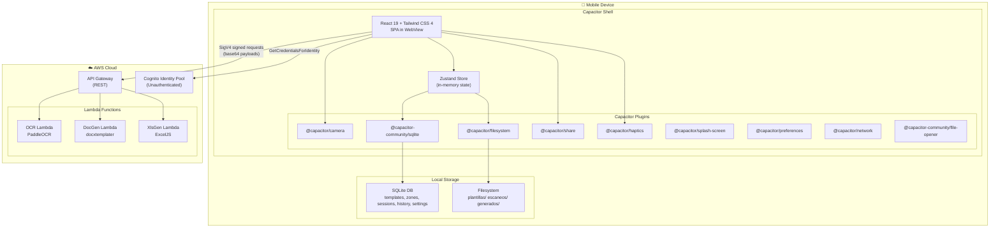
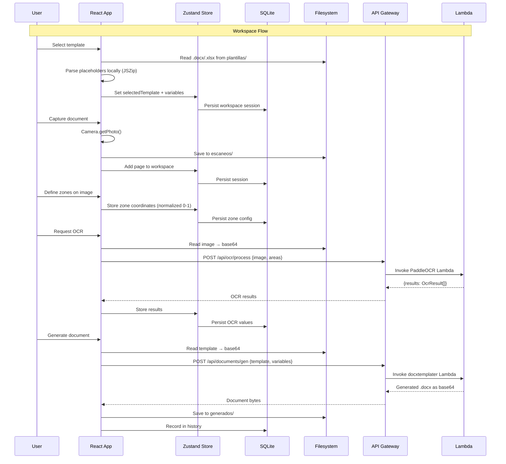
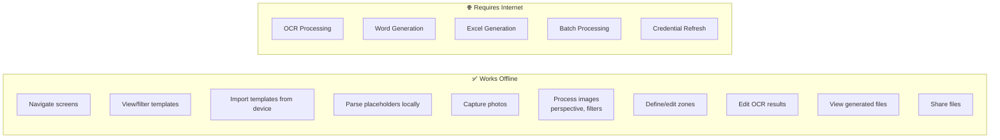

# Design Document: Mobile Native Migration

## Overview

This design transforms the existing Document Digitization React web app (`mobile_app/`) into a native mobile application using Capacitor as the bridge layer. The architecture follows a **hybrid model**:

- **Client-side**: React 19 + Vite 8 + Tailwind CSS 4 + TypeScript 5.7 packaged in a native WebView via Capacitor
- **Local storage**: SQLite (metadata) + Filesystem (binary files) — all data lives on-device
- **Cloud processing**: AWS Lambda via API Gateway for heavy computation (OCR with PaddleOCR, document generation with docxtemplater/ExcelJS)
- **State management**: Zustand with SQLite-backed persistence
- **Auth**: Cognito Identity Pool (unauthenticated) → SigV4 signed requests

The app works partially offline (navigation, template viewing, zone editing) and requires internet only for OCR and document generation.

## Architecture

### High-Level System Diagram



### Data Flow Diagram



### Offline/Online Boundary



## Components and Interfaces

### Project Structure (mobile_app/src/)

```
mobile_app/
├── capacitor.config.ts             # Capacitor configuration (project root)
│
src/
├── main.tsx                    # Entry point + Capacitor init
├── App.tsx                     # Root component with navigation
│
├── components/
│   ├── navigation/
│   │   └── TabBar.tsx          # Bottom tab navigation
│   ├── home/
│   │   └── HomeScreen.tsx      # Dashboard with stats & quick actions
│   ├── templates/
│   │   ├── TemplatesScreen.tsx # Template list + filter + search
│   │   ├── TemplateDetail.tsx  # Template detail sheet
│   │   └── TemplateImport.tsx  # Import flow
│   ├── scan/
│   │   ├── ScanScreen.tsx      # Camera capture + processing pipeline
│   │   ├── PerspectiveEditor.tsx
│   │   └── FilterToolbar.tsx
│   ├── workspace/
│   │   ├── WorkspaceScreen.tsx # 6-step stepper
│   │   ├── ZoneEditor.tsx      # Draw/edit zones on image
│   │   ├── OcrResults.tsx      # Edit extracted values
│   │   ├── PageThumbnails.tsx  # Reorderable page list
│   │   └── GeneratePanel.tsx   # Document generation
│   ├── files/
│   │   ├── FilesScreen.tsx     # Generated files list
│   │   └── ZipViewer.tsx       # ZIP contents viewer
│   ├── settings/
│   │   └── SettingsScreen.tsx  # Preferences & info
│   └── ui/
│       ├── Toast.tsx
│       ├── StatusBar.tsx
│       ├── ToggleBtn.tsx
│       └── ProgressBar.tsx
│
├── store/
│   ├── useAppStore.ts          # Main Zustand store (slices combined)
│   ├── slices/
│   │   ├── templateSlice.ts
│   │   ├── workspaceSlice.ts
│   │   ├── settingsSlice.ts
│   │   ├── historySlice.ts
│   │   └── filesSlice.ts
│   └── persistence.ts          # SQLite persistence middleware
│
├── services/
│   ├── database.ts             # SQLite initialization & queries
│   ├── filesystem.ts           # Filesystem operations wrapper
│   ├── templateParser.ts       # Local .docx/.xlsx parsing
│   ├── imageProcessor.ts       # Canvas-based image processing
│   ├── apiClient.ts            # SigV4 signed HTTP client
│   ├── authService.ts          # Cognito credential management
│   ├── ocrService.ts           # OCR request/response handling
│   ├── docGenService.ts        # Document generation client
│   ├── batchService.ts         # Batch processing orchestrator
│   ├── zipService.ts           # ZIP creation/extraction (JSZip)
│   └── connectivityService.ts  # Network status monitoring
│
├── types/
│   └── index.ts                # All TypeScript interfaces
│
└── utils/
    ├── coordinates.ts          # Normalized coordinate math
    ├── multiRecord.ts          # Record expansion logic
    └── constants.ts            # App constants, palette, config
```

### Key Interfaces (Low-Level Design)

```typescript
// ── src/types/index.ts ──────────────────────────────────────────────────────

// Navigation
type Tab = 'home' | 'templates' | 'scan' | 'workspace' | 'settings';

// Templates
interface TemplateMetadata {
  id: string;
  nombre: string;
  tipo: 'docx' | 'xlsx';
  variables: string[];        // extracted placeholders / headers
  fechaImportacion: string;   // ISO date
  tamañoArchivo: number;      // bytes
  rutaLocal: string;          // path in Filesystem
  favorito: boolean;
}

// Zone Configuration
interface ZoneArea {
  id: string;
  x: number;       // normalized 0-1
  y: number;       // normalized 0-1
  width: number;   // normalized 0-1
  height: number;  // normalized 0-1
  variableName: string;
  color: string;
}

interface ZoneConfig {
  id: string;
  templateId: string;
  nombreConfig: string;
  areas: ZoneArea[];
  fechaModificacion: string;
}

// Workspace
type WorkspaceStep = 0 | 1 | 2 | 3 | 4 | 5;

interface ScannedPage {
  id: string;
  rutaImagen: string;     // path in escaneos/
  orientacion: 'vertical' | 'horizontal';
  zonas: ZoneArea[];
  status: 'pending' | 'processing' | 'done' | 'error';
  ocrResults?: OcrResult[];
  order: number;
}

interface WorkspaceSession {
  id: string;
  pasoActual: WorkspaceStep;
  templateWordId: string | null;
  templateXlsxId: string | null;
  paginas: ScannedPage[];
  valoresOcr: Record<string, string>;  // variableName → editedValue
  variableConfigs: VariableConfig[];   // per-variable settings (broadcast, split, required)
  fechaInicio: string;
}

// OCR
interface OcrResult {
  variableName: string;
  extractedText: string;
  confidence: number;  // 0-100
}

// Variable Configuration
interface VariableConfig {
  variableName: string;
  required: boolean;
  broadcast: boolean;      // copy to all records
  splitLines: boolean;     // each line = separate record
}

// History
interface HistoryEntry {
  id: string;
  tipoAccion: 'scan' | 'ocr' | 'generate_docx' | 'generate_xlsx' | 'import' | 'batch';
  nombreRecurso: string;
  fecha: string;
  metadatos: Record<string, unknown>;
}

// API Responses (following zustand-api-contracts steering)
interface ApiError {
  code: string;
  message: string;     // always in Spanish
  retryable: boolean;
}

interface OcrResponse {
  results: OcrResult[];
}

interface DocGenResponse {
  documentBase64: string;
  filename: string;
}

// Excel generation endpoint response (same structure as DocGen)
interface XlsGenResponse {
  documentBase64: string;
  filename: string;
}

// Auth
interface AwsCredentials {
  accessKeyId: string;
  secretAccessKey: string;
  sessionToken: string;
  expiration: number;  // Unix timestamp ms
}
```

### Service Interfaces (Function Signatures)

```typescript
// ── src/services/database.ts ────────────────────────────────────────────────

/** Initialize SQLite database with all tables. Called once on app startup. */
async function initDatabase(): Promise<void>;

/** Generic CRUD for any table */
async function insertRecord<T>(table: string, record: T): Promise<void>;
async function getRecords<T>(table: string, where?: Partial<T>): Promise<T[]>;
async function updateRecord<T>(table: string, id: string, updates: Partial<T>): Promise<void>;
async function deleteRecord(table: string, id: string): Promise<void>;

// ── src/services/filesystem.ts ──────────────────────────────────────────────

/** Ensure directory structure exists: plantillas/, escaneos/, generados/ */
async function initDirectories(): Promise<void>;

/** Write binary file (base64) to a specific directory */
async function writeFile(dir: 'plantillas' | 'escaneos' | 'generados', filename: string, base64Data: string): Promise<string>;

/** Read file as base64 */
async function readFileAsBase64(path: string): Promise<string>;

/** Delete a file */
async function deleteLocalFile(path: string): Promise<void>;

/** Calculate total storage used by all app directories */
async function calculateStorageUsed(): Promise<number>;

/** Clean cache: delete all files in escaneos/ and generados/ */
async function cleanCache(): Promise<void>;

// ── src/services/templateParser.ts ──────────────────────────────────────────

/** Extract {{variable}} placeholders from .docx XML via JSZip */
async function extractDocxPlaceholders(base64Docx: string): Promise<string[]>;

/** Extract first-row headers from .xlsx via xlsx parser */
async function extractXlsxHeaders(base64Xlsx: string): Promise<string[]>;

// ── src/services/imageProcessor.ts ──────────────────────────────────────────

/** Apply 4-point perspective correction using Canvas transform */
function applyPerspectiveCorrection(
  imageData: ImageData,
  corners: [Point, Point, Point, Point]
): ImageData;

/** Apply grayscale filter */
function applyGrayscale(imageData: ImageData): ImageData;

/** Apply contrast enhancement */
function applyContrast(imageData: ImageData, factor: number): ImageData;

/** Apply sharpness enhancement */
function applySharpen(imageData: ImageData): ImageData;

/** Compress to JPEG at given quality (0-1), enforce max 4096x4096 */
function compressImage(
  canvas: HTMLCanvasElement,
  quality: number,
  maxDimension?: number
): Promise<string>; // returns base64 JPEG

/** Resize proportionally if exceeds maxDimension */
function enforceMaxSize(width: number, height: number, max: number): { width: number; height: number };

// ── src/services/authService.ts ─────────────────────────────────────────────

/** Get or refresh AWS credentials via Cognito Identity Pool */
async function getCredentials(): Promise<AwsCredentials>;

/** Check if credentials are about to expire (within 5 min) */
function isExpiringSoon(credentials: AwsCredentials): boolean;

/** Proactively refresh credentials in background */
async function refreshCredentials(): Promise<void>;

// ── src/services/apiClient.ts ───────────────────────────────────────────────

/** Sign and send request to API Gateway with SigV4 */
async function signedRequest<T>(
  method: 'GET' | 'POST',
  path: string,
  body?: unknown
): Promise<T>;

// ── src/services/ocrService.ts ───────────────────────────────────────────────

/** Send image + areas to OCR Lambda and return extracted text per zone */
async function processOcr(
  imageBase64: string,
  areas: ZoneArea[]
): Promise<OcrResult[]>;

// ── src/services/docGenService.ts ───────────────────────────────────────────

/** Generate a Word document by filling template placeholders with values */
async function generateWord(
  templateBase64: string,
  variables: Record<string, string>
): Promise<DocGenResponse>;

/** Generate an Excel document by appending records as rows */
async function generateXlsx(
  templateBase64: string,
  records: Record<string, string>[]
): Promise<DocGenResponse>;

// ── src/services/batchService.ts ────────────────────────────────────────────

/** Process a batch of pages: OCR + generation for each page sequentially */
async function processBatch(
  pages: ScannedPage[],
  templateWordBase64: string,
  templateXlsxBase64: string | null,
  variableConfigs: VariableConfig[],
  onProgress: (current: number, total: number) => void
): Promise<BatchResult>;

/** Retry only the failed pages from a previous batch */
async function retryFailedPages(
  failedPageIds: string[],
  templateWordBase64: string,
  templateXlsxBase64: string | null,
  variableConfigs: VariableConfig[]
): Promise<BatchResult>;

// ── src/services/zipService.ts ──────────────────────────────────────────────

/** Create ZIP from array of files */
async function createZip(files: Array<{ name: string; base64: string }>): Promise<string>;

/** List files in a ZIP */
async function listZipContents(base64Zip: string): Promise<Array<{ name: string; size: number }>>;

/** Extract a single file from ZIP */
async function extractFileFromZip(base64Zip: string, fileName: string): Promise<string>;
```

### Lambda API Endpoints (Mobile App → API Gateway)

| Endpoint | Method | Request Body | Response Body |
|----------|--------|-------------|---------------|
| `/api/ocr/process` | POST | `{ image: string, areas: ZoneArea[] }` | `{ results: OcrResult[] }` |
| `/api/documents/gen` | POST | `{ template: string, variables: Record<string, string> }` | `{ documentBase64: string, filename: string }` |
| `/api/documents/xlsx` | POST | `{ template: string, records: Record<string, string>[] }` | `{ documentBase64: string, filename: string }` |

#### `POST /api/documents/xlsx` — Excel Generation

Generates a filled Excel spreadsheet by appending rows to the template.

**Request:**
```json
{
  "template": "<base64-encoded .xlsx file>",
  "records": [
    { "columna1": "valor1", "columna2": "valor2" },
    { "columna1": "valor3", "columna2": "valor4" }
  ]
}
```

**Success Response (200):**
```json
{
  "documentBase64": "<base64-encoded generated .xlsx>",
  "filename": "generated_20250101_120000.xlsx"
}
```

**Error Response (4xx/5xx):**
```json
{
  "error": {
    "code": "TEMPLATE_INVALID | INVALID_RECORDS | GENERATION_FAILED",
    "message": "Mensaje descriptivo en español",
    "retryable": true
  }
}
```

All endpoints follow the error contract defined in the API error interface (`ApiError`). Requests are signed with SigV4 using credentials from Cognito Identity Pool.

### Zustand Store Design

```typescript
// ── src/store/useAppStore.ts ────────────────────────────────────────────────

import { create } from 'zustand';

interface AppState {
  // ── Template Slice ──
  templates: TemplateMetadata[];
  loadTemplates: () => Promise<void>;
  importTemplate: (fileUri: string) => Promise<void>;
  deleteTemplate: (id: string) => Promise<void>;
  toggleFavorite: (id: string) => Promise<void>;

  // ── Workspace Slice ──
  session: WorkspaceSession | null;
  initWorkspace: () => Promise<void>;
  restoreSession: () => Promise<void>;
  setStep: (step: WorkspaceStep) => Promise<void>;
  selectWordTemplate: (id: string) => Promise<void>;
  selectXlsxTemplate: (id: string | null) => Promise<void>;
  addPage: (imageUri: string) => Promise<void>;
  removePage: (pageId: string) => Promise<void>;
  reorderPages: (fromIndex: number, toIndex: number) => Promise<void>;
  updateZones: (pageId: string, zones: ZoneArea[]) => Promise<void>;
  propagateZones: (sourcePageId: string) => Promise<void>;
  undoPropagation: () => Promise<void>;
  /** In-memory snapshot stored before propagation for undo. Not persisted to SQLite. */
  _previousZonesSnapshot: Map<string, ZoneArea[]> | null;
  setOcrResults: (pageId: string, results: OcrResult[]) => Promise<void>;
  updateEditedValue: (variableName: string, value: string) => Promise<void>;
  updateVariableConfig: (variableName: string, updates: Partial<Omit<VariableConfig, 'variableName'>>) => Promise<void>;
  discardSession: () => Promise<void>;

  // ── Settings Slice ──
  captureQuality: number;  // 0.6 | 0.8 | 0.95
  setCaptureQuality: (quality: number) => Promise<void>;
  
  // ── History Slice ──
  history: HistoryEntry[];
  loadHistory: () => Promise<void>;
  addHistoryEntry: (entry: Omit<HistoryEntry, 'id' | 'fecha'>) => Promise<void>;

  // ── Files Slice ──
  generatedFiles: Array<{ name: string; type: string; size: number; date: string; path: string }>;
  loadGeneratedFiles: () => Promise<void>;
  sortFilesBy: (criteria: 'date' | 'name' | 'size') => void;
  deleteGeneratedFile: (path: string) => Promise<void>;

  // ── UI Slice ──
  isOnline: boolean;
  credentials: AwsCredentials | null;
  loading: boolean;
  toast: string | null;
  setToast: (msg: string | null) => void;
}

// Usage (following steering rule: individual selectors)
// const templates = useAppStore((s) => s.templates);
// const session = useAppStore((s) => s.session);
```

### Persistence Middleware

```typescript
// ── src/store/persistence.ts ────────────────────────────────────────────────

/**
 * Zustand middleware that syncs state changes to SQLite.
 * On every workspace-related state change, persists the session.
 * On startup, hydrates the store from SQLite.
 */
function sqlitePersistence(config) {
  return (set, get, api) => {
    // Wrap set to auto-persist workspace changes
    const persistingSet = (partial) => {
      set(partial);
      const state = get();
      if (state.session) {
        persistWorkspaceSession(state.session);
      }
    };
    return config(persistingSet, get, api);
  };
}
```

### Zone Propagation Undo Mechanism

The undo mechanism for zone propagation uses a **temporary in-memory snapshot** stored in the Zustand store. It is NOT persisted to SQLite — it only lives in memory during the current app session.

```typescript
// ── Undo design (inside workspaceSlice) ─────────────────────────────────────

/**
 * _previousZonesSnapshot: Map<pageId, ZoneArea[]>
 * 
 * - Stored BEFORE propagation occurs
 * - Contains each page's zone state prior to overwrite
 * - Used by undoPropagation() to restore per-page zones
 * - Cleared on: new propagation, session discard, or app restart
 * - NOT persisted to SQLite (ephemeral, in-memory only)
 * 
 * Flow:
 * 1. User clicks "Propagar"
 * 2. Store snapshots current zones for all target pages:
 *      _previousZonesSnapshot = new Map(
 *        session.paginas.filter(p => p.id !== sourcePageId)
 *          .map(p => [p.id, [...p.zonas]])
 *      )
 * 3. Zones from source page are copied to all other pages
 * 4. If user clicks "Deshacer":
 *      For each [pageId, zones] in _previousZonesSnapshot:
 *        restore page.zonas = zones
 *      _previousZonesSnapshot = null
 */
```

### Capacitor Configuration

```typescript
// ── mobile_app/capacitor.config.ts ──────────────────────────────────────────

import type { CapacitorConfig } from '@capacitor/cli';

const config: CapacitorConfig = {
  appId: 'com.docdigitization.app',
  appName: 'Document Digitization',
  webDir: 'dist',
  server: {
    // Dev only: uncomment for live-reload
    // url: 'http://192.168.x.x:8443',
    androidScheme: 'https',
  },
  plugins: {
    SplashScreen: {
      backgroundColor: '#3A1078',
      launchAutoHide: true,
      androidSplashResourceName: 'splash',
    },
    Camera: {
      presentationStyle: 'fullScreen',
    },
    Network: {
      // Uses default config; connectivity changes trigger store update
    },
    FileOpener: {
      // @capacitor-community/file-opener — opens files with system default app
    },
  },
};

export default config;
```

### Environment Variables

The following environment variables must be defined in `.env` (loaded by Vite at build time):

| Variable | Description |
|----------|-------------|
| `VITE_COGNITO_IDENTITY_POOL_ID` | AWS Cognito Identity Pool ID for unauthenticated access |
| `VITE_AWS_REGION` | AWS region (e.g., `us-east-1`) |
| `VITE_API_GATEWAY_URL` | Base URL of the API Gateway REST endpoint (e.g., `https://abc123.execute-api.us-east-1.amazonaws.com/prod`) |

Usage in code:
```typescript
const IDENTITY_POOL_ID = import.meta.env.VITE_COGNITO_IDENTITY_POOL_ID;
const REGION = import.meta.env.VITE_AWS_REGION;
const API_BASE = import.meta.env.VITE_API_GATEWAY_URL;
```

## Data Models

### SQLite Schema

```sql
-- ── Database: docdigitization.db ────────────────────────────────────────────

CREATE TABLE IF NOT EXISTS templates (
  id TEXT PRIMARY KEY,
  nombre TEXT NOT NULL,
  tipo TEXT NOT NULL CHECK(tipo IN ('docx', 'xlsx')),
  variables TEXT NOT NULL DEFAULT '[]',  -- JSON array of strings
  fecha_importacion TEXT NOT NULL,        -- ISO 8601
  tamaño_archivo INTEGER NOT NULL,       -- bytes
  ruta_local TEXT NOT NULL,              -- relative path in plantillas/
  favorito INTEGER NOT NULL DEFAULT 0    -- boolean 0/1
);

CREATE TABLE IF NOT EXISTS zone_configs (
  id TEXT PRIMARY KEY,
  template_id TEXT NOT NULL,
  nombre_config TEXT NOT NULL,
  areas TEXT NOT NULL DEFAULT '[]',      -- JSON array of ZoneArea
  fecha_modificacion TEXT NOT NULL,
  FOREIGN KEY (template_id) REFERENCES templates(id) ON DELETE CASCADE
);

CREATE TABLE IF NOT EXISTS workspace_sessions (
  id TEXT PRIMARY KEY,
  paso_actual INTEGER NOT NULL DEFAULT 0,
  template_word_id TEXT,
  template_xlsx_id TEXT,
  paginas TEXT NOT NULL DEFAULT '[]',     -- JSON array of ScannedPage
  valores_ocr TEXT NOT NULL DEFAULT '{}', -- JSON object {variable: value}
  variable_configs TEXT NOT NULL DEFAULT '[]', -- JSON array of VariableConfig
  fecha_inicio TEXT NOT NULL,
  activa INTEGER NOT NULL DEFAULT 1      -- boolean: is this the active session?
);

CREATE TABLE IF NOT EXISTS history (
  id TEXT PRIMARY KEY,
  tipo_accion TEXT NOT NULL,
  nombre_recurso TEXT NOT NULL,
  fecha TEXT NOT NULL,
  metadatos TEXT NOT NULL DEFAULT '{}'   -- JSON object
);

CREATE TABLE IF NOT EXISTS settings (
  key TEXT PRIMARY KEY,
  value TEXT NOT NULL
);
```

### Filesystem Directory Layout

```
Documents/                          (Directory.Documents on device)
└── DocDigitization/
    ├── plantillas/
    │   ├── {uuid}.docx
    │   └── {uuid}.xlsx
    ├── escaneos/
    │   ├── {uuid}.jpg              (compressed JPEG captures)
    │   └── {uuid}_original.jpg    (pre-filter backup for revert)
    └── generados/
        ├── {uuid}.docx
        ├── {uuid}.xlsx
        └── {uuid}_batch.zip
```

### Multi-Record Expansion Algorithm

```typescript
// ── src/utils/multiRecord.ts ────────────────────────────────────────────────

/**
 * Expands OCR values into multiple records based on variable configurations.
 * 
 * Rules:
 * - Variables with splitLines=true: each line becomes a separate record
 * - Variables with broadcast=true: value is copied to ALL records
 * - Record count = max(lineCount) across all split variables
 * - Non-split, non-broadcast variables: value goes to first record only
 * 
 * @example
 * variables = { nombre: "Ana\nLuis\nPedro", edad: "25\n30\n28", club: "Lions" }
 * configs = [
 *   { variableName: 'nombre', splitLines: true, broadcast: false },
 *   { variableName: 'edad', splitLines: true, broadcast: false },
 *   { variableName: 'club', splitLines: false, broadcast: true },
 * ]
 * Result: [
 *   { nombre: "Ana", edad: "25", club: "Lions" },
 *   { nombre: "Luis", edad: "30", club: "Lions" },
 *   { nombre: "Pedro", edad: "28", club: "Lions" },
 * ]
 */
function expandRecords(
  values: Record<string, string>,
  configs: VariableConfig[]
): Record<string, string>[] {
  // 1. Find max line count among split variables
  const splitVars = configs.filter(c => c.splitLines);
  const maxLines = Math.max(1, ...splitVars.map(v => 
    (values[v.variableName] || '').split('\n').filter(l => l.trim()).length
  ));

  // 2. Build records
  const records: Record<string, string>[] = [];
  for (let i = 0; i < maxLines; i++) {
    const record: Record<string, string> = {};
    for (const config of configs) {
      const value = values[config.variableName] || '';
      if (config.splitLines) {
        const lines = value.split('\n').filter(l => l.trim());
        record[config.variableName] = lines[i] || '';
      } else if (config.broadcast) {
        record[config.variableName] = value;
      } else {
        record[config.variableName] = i === 0 ? value : '';
      }
    }
    records.push(record);
  }
  return records;
}
```

### Coordinate Normalization & Transformation

```typescript
// ── src/utils/coordinates.ts ────────────────────────────────────────────────

interface NormalizedRect {
  x: number;      // 0-1
  y: number;      // 0-1
  width: number;  // 0-1
  height: number; // 0-1
}

/** Convert pixel coordinates to normalized (0-1) relative to image size */
function pixelsToNormalized(
  px: { x: number; y: number; width: number; height: number },
  imageWidth: number,
  imageHeight: number
): NormalizedRect {
  return {
    x: clamp(px.x / imageWidth, 0, 1),
    y: clamp(px.y / imageHeight, 0, 1),
    width: clamp(px.width / imageWidth, 0, 1),
    height: clamp(px.height / imageHeight, 0, 1),
  };
}

/** Transform zone coordinates when orientation changes */
function rotateCoordinates(
  rect: NormalizedRect,
  from: 'vertical' | 'horizontal',
  to: 'vertical' | 'horizontal'
): NormalizedRect {
  if (from === to) return rect;
  // 90° clockwise: (x, y, w, h) → (1 - y - h, x, h, w)
  return {
    x: 1 - rect.y - rect.height,
    y: rect.x,
    width: rect.height,
    height: rect.width,
  };
}

/** Ensure rect stays within [0,1] bounds after move/resize */
function clampRect(rect: NormalizedRect): NormalizedRect {
  const x = clamp(rect.x, 0, 1 - rect.width);
  const y = clamp(rect.y, 0, 1 - rect.height);
  const width = clamp(rect.width, 0.01, 1 - x);
  const height = clamp(rect.height, 0.01, 1 - y);
  return { x, y, width, height };
}

function clamp(value: number, min: number, max: number): number {
  return Math.min(Math.max(value, min), max);
}
```

### Auth Flow (Cognito Identity Pool → SigV4)

```typescript
// ── src/services/authService.ts (pseudocode) ────────────────────────────────

import { CognitoIdentityClient, GetIdCommand, GetCredentialsForIdentityCommand } from '@aws-sdk/client-cognito-identity';
import { Preferences } from '@capacitor/preferences';

const IDENTITY_POOL_ID = import.meta.env.VITE_COGNITO_IDENTITY_POOL_ID;
const REGION = import.meta.env.VITE_AWS_REGION;

const cognitoClient = new CognitoIdentityClient({ region: REGION });

async function getCredentials(): Promise<AwsCredentials> {
  // 1. Check cached credentials
  const cached = await getCachedCredentials();
  if (cached && !isExpiringSoon(cached)) {
    return cached;
  }

  // 2. Get identity ID (or reuse cached one)
  const identityId = await getOrCreateIdentityId();

  // 3. Get temporary credentials
  const response = await cognitoClient.send(
    new GetCredentialsForIdentityCommand({ IdentityId: identityId })
  );

  const credentials: AwsCredentials = {
    accessKeyId: response.Credentials!.AccessKeyId!,
    secretAccessKey: response.Credentials!.SecretKey!,
    sessionToken: response.Credentials!.SessionToken!,
    expiration: response.Credentials!.Expiration!.getTime(),
  };

  // 4. Cache with Preferences plugin
  await Preferences.set({
    key: 'aws_credentials',
    value: JSON.stringify(credentials),
  });

  return credentials;
}

function isExpiringSoon(creds: AwsCredentials): boolean {
  const fiveMinutes = 5 * 60 * 1000;
  return Date.now() > creds.expiration - fiveMinutes;
}
```

### SigV4 Signing (Low-Level)

```typescript
// ── src/services/apiClient.ts (pseudocode) ──────────────────────────────────

import { SignatureV4 } from '@smithy/signature-v4';
import { Sha256 } from '@aws-crypto/sha256-js';
import { HttpRequest } from '@smithy/protocol-http';

const API_BASE = import.meta.env.VITE_API_GATEWAY_URL;
const REGION = import.meta.env.VITE_AWS_REGION;

async function signedRequest<T>(
  method: 'GET' | 'POST',
  path: string,
  body?: unknown
): Promise<T> {
  const credentials = await getCredentials();

  const signer = new SignatureV4({
    credentials: {
      accessKeyId: credentials.accessKeyId,
      secretAccessKey: credentials.secretAccessKey,
      sessionToken: credentials.sessionToken,
    },
    region: REGION,
    service: 'execute-api',
    sha256: Sha256,
  });

  const request = new HttpRequest({
    method,
    hostname: new URL(API_BASE).hostname,
    path,
    headers: {
      'Content-Type': 'application/json',
      host: new URL(API_BASE).hostname,
    },
    body: body ? JSON.stringify(body) : undefined,
  });

  const signed = await signer.sign(request);

  const response = await fetch(`${API_BASE}${path}`, {
    method,
    headers: signed.headers as Record<string, string>,
    body: signed.body,
  });

  if (!response.ok) {
    const errorData = await response.json();
    throw new ApiError(errorData.error);
  }

  return response.json() as Promise<T>;
}
```

## Correctness Properties

*A property is a characteristic or behavior that should hold true across all valid executions of a system — essentially, a formal statement about what the system should do. Properties serve as the bridge between human-readable specifications and machine-verifiable correctness guarantees.*

### Property 1: SQLite Persistence Round-Trip

*For any* valid domain entity (TemplateMetadata, ZoneConfig, WorkspaceSession, HistoryEntry, OcrResult, VariableConfig), serializing it to SQLite via the database service and then deserializing it back SHALL produce an object equivalent to the original.

**Validates: Requirements 2.3, 2.4, 2.5, 2.6, 3.1, 6.5, 7.3, 8.3, 9.3, 11.5, 12.3, 17.4**

### Property 2: Docx Placeholder Parser Round-Trip

*For any* set of valid variable names (non-empty strings without `{{` or `}}`), constructing a mock .docx XML content with those variables as `{{variableName}}` placeholders and then parsing it with `extractDocxPlaceholders` SHALL return the exact same set of variable names.

**Validates: Requirements 3.2**

### Property 3: Xlsx Header Parser

*For any* list of non-empty column name strings, constructing a mock .xlsx with those strings as the first-row headers and then parsing it with `extractXlsxHeaders` SHALL return the exact same list of column names in order.

**Validates: Requirements 3.3**

### Property 4: Template Filter Correctness

*For any* list of templates and any filter criteria (type filter + search string), all templates in the filtered result SHALL match the type filter AND contain the search string (case-insensitive) in their name. Additionally, no template matching the criteria SHALL be excluded from the result.

**Validates: Requirements 3.5**

### Property 5: Image Filter Pixel Invariants

*For any* valid ImageData (array of RGBA pixel values), applying the grayscale filter SHALL produce an ImageData where every pixel has R = G = B (equal channel values). Applying contrast with factor > 1 SHALL produce pixels where the distance from the midpoint (128) is greater than or equal to the original distance.

**Validates: Requirements 5.2**

### Property 6: Image Size Constraint

*For any* image dimensions (width, height) where either dimension exceeds 4096, applying `enforceMaxSize(width, height, 4096)` SHALL produce dimensions where max(resultWidth, resultHeight) ≤ 4096 AND the aspect ratio (width/height) is preserved within floating-point tolerance (±0.01).

**Validates: Requirements 5.6**

### Property 7: Zone Coordinate Normalization Invariant

*For any* zone area and any sequence of operations (create, move, resize, rotate orientation), all resulting coordinate values (x, y, width, height) SHALL remain within the range [0, 1], and width and height SHALL remain ≥ 0.01.

**Validates: Requirements 6.4, 6.7, 18.2**

### Property 8: API Request Payload Schema

*For any* valid input data (image base64 + areas for OCR, template base64 + variables for DocGen, template base64 + records for XlsGen), the constructed API request payload SHALL conform to the expected schema: OCR requires `{image: string, areas: ZoneArea[]}`, DocGen requires `{template: string, variables: Record<string, string>}`, XlsGen requires `{template: string, records: Record<string, string>[]}`.

**Validates: Requirements 7.1, 8.1, 9.1**

### Property 9: ZIP Round-Trip

*For any* set of files (each with a name and base64 content), creating a ZIP with `createZip` and then listing its contents with `listZipContents` SHALL return file entries with names matching the original set. Extracting any individual file with `extractFileFromZip` SHALL return base64 content identical to the original.

**Validates: Requirements 10.3, 16.2, 16.3**

### Property 10: Batch Failure Resilience

*For any* batch of N pages where pages at arbitrary positions fail, the batch processor SHALL (1) process all N pages regardless of individual failures, (2) the set of successfully generated documents SHALL exactly match the pages that did not fail, and (3) retrying SHALL only re-process the failed pages without touching successful ones.

**Validates: Requirements 10.5, 10.6**

### Property 11: Multi-Record Expansion

*For any* set of variable values and variable configurations (with arbitrary combinations of splitLines and broadcast), `expandRecords` SHALL produce exactly max(1, max line count of split variables) records, where every record contains the broadcast variables with their full value, split variables with their corresponding line, and the expanded record count equals the longest split variable's line count.

**Validates: Requirements 17.2, 17.3, 17.5**

### Property 12: Zone Propagation and Undo

*For any* workspace with N pages where page 1 has zones defined, propagating zones SHALL result in all N pages having zone definitions identical to page 1. Subsequently calling undo SHALL restore each page to its pre-propagation zone state.

**Validates: Requirements 18.1, 18.4**

### Property 13: Page Ordering Invariant

*For any* list of pages and any sequence of operations (add, remove, reorder), the resulting page numbering SHALL be sequential starting from 1 with no gaps, and the total count SHALL equal the number of pages present.

**Validates: Requirements 11.4, 19.2, 19.3**

### Property 14: Confidence Color Mapping

*For any* confidence value in the range [0, 100], the color mapping function SHALL return: green for values > 80 (i.e., 81–100), yellow for values in [50, 80] (i.e., 50–80 inclusive), and red for values < 50 (i.e., 0–49 inclusive). The boundaries are explicit: 49 → red, 50 → yellow, 80 → yellow, 81 → green.

**Validates: Requirements 12.2**

### Property 15: Contextual Greeting

*For any* hour value in [0, 23], the greeting function SHALL return "Buenos días" for hours [0, 11], "Buenas tardes" for hours [12, 17], and "Buenas noches" for hours [18, 23].

**Validates: Requirements 15.1**

### Property 16: File Sort Order

*For any* list of files with creation dates, sorting by date descending SHALL produce a list where each file's date is greater than or equal to the next file's date. The relative order of files with equal dates SHALL be stable.

**Validates: Requirements 16.7**

### Property 17: Credential Expiration Management

*For any* set of credentials with an expiration timestamp, `isExpiringSoon` SHALL return `true` when the current time is within 5 minutes of expiration, and `false` otherwise. Cached credentials that are not expiring soon SHALL be returned without network calls.

**Validates: Requirements 14.2**

### Property 18: SigV4 Request Signing

*For any* valid HTTP request (method, path, optional body), signing with SigV4 SHALL produce a request containing an `Authorization` header with the pattern `AWS4-HMAC-SHA256 Credential=.../execute-api, SignedHeaders=..., Signature=...` and an `x-amz-security-token` header matching the session token.

**Validates: Requirements 14.4**

## Error Handling

### Error Strategy by Layer

| Layer | Strategy | User Experience |
|-------|----------|----------------|
| **Capacitor Plugin** | Try/catch + specific error codes | Toast with Spanish message + guidance |
| **SQLite** | Transaction rollback on failure | Toast "Error al guardar. Intente nuevamente" |
| **Filesystem** | Verify write success, cleanup on failure | Toast with specific file operation error |
| **Network (API)** | Structured `{code, message, retryable}` | Error card with retry button if retryable |
| **Auth (Cognito)** | Retry with exponential backoff (3 attempts) | "No se pudo autenticar" + manual retry |

### Error Response Contract (Lambda → App)

```typescript
// All Lambda errors follow this structure
interface LambdaErrorResponse {
  error: {
    code: string;       // Machine-readable: OCR_FAILED, TEMPLATE_INVALID, etc.
    message: string;    // Human-readable in Spanish
    retryable: boolean; // Whether user should retry
  }
}

// Error codes by service:
// OCR: OCR_TIMEOUT, OCR_FAILED, IMAGE_TOO_LARGE, INVALID_IMAGE_FORMAT
// DocGen: TEMPLATE_INVALID, PLACEHOLDER_MISMATCH, GENERATION_FAILED
// XlsGen: TEMPLATE_INVALID, INVALID_RECORDS, GENERATION_FAILED
```

### Connectivity Handling

```typescript
// ── src/services/connectivityService.ts ─────────────────────────────────────

import { Network } from '@capacitor/network';

// Listen for connectivity changes
Network.addListener('networkStatusChange', (status) => {
  useAppStore.setState({ isOnline: status.connected });
});

// UI components check isOnline before cloud operations:
// - OCR button: disabled + "Requiere conexión a internet"
// - Generate button: disabled + "Requiere conexión a internet"
// - Offline-capable actions work normally
```

### Permission Denial Handling

```typescript
// Camera permission denied
const handlePermissionDenied = () => {
  showToast({
    message: 'Permiso de cámara denegado. Ve a Configuración > Apps > Document Digitization > Permisos para habilitarlo.',
    duration: 5000,
  });
};
```

### Batch Error Recovery

```typescript
// During batch processing, individual page failures don't stop the batch
interface BatchResult {
  successful: Array<{ pageId: string; filePath: string }>;
  failed: Array<{ pageId: string; error: ApiError }>;
}

// User can retry only failed pages
async function retryFailedPages(failedPageIds: string[]): Promise<BatchResult>;
```

## Testing Strategy

### Testing Stack

| Tool | Purpose |
|------|---------|
| **Vitest** | Test runner (fast, Vite-native) |
| **fast-check** | Property-based testing library |
| **@testing-library/react** | Component testing |
| **MSW (Mock Service Worker)** | API mocking for integration tests |

### Test Organization

```
mobile_app/
├── src/
│   ├── services/__tests__/
│   │   ├── database.test.ts          # SQLite round-trip properties
│   │   ├── templateParser.test.ts    # Parser properties
│   │   ├── imageProcessor.test.ts    # Image filter properties
│   │   ├── apiClient.test.ts         # SigV4 signing properties
│   │   ├── zipService.test.ts        # ZIP round-trip properties
│   │   └── authService.test.ts       # Credential management
│   ├── utils/__tests__/
│   │   ├── coordinates.test.ts       # Coordinate invariant properties
│   │   ├── multiRecord.test.ts       # Record expansion properties
│   │   └── confidence.test.ts        # Color mapping property
│   ├── store/__tests__/
│   │   ├── workspaceSlice.test.ts    # Page ordering + propagation
│   │   └── templateSlice.test.ts     # Filter property
│   └── components/__tests__/
│       └── ... (example-based component tests)
├── tests/
│   └── integration/
│       ├── ocr.integration.test.ts   # MSW-mocked OCR flow
│       └── docgen.integration.test.ts
└── vitest.config.ts
```

### Property-Based Testing Configuration

- **Library**: fast-check
- **Minimum iterations**: 100 per property test
- **Tag format**: `// Feature: mobile-native-migration, Property N: <description>`

Each correctness property (1-18) maps to a single property-based test using fast-check arbitraries to generate random inputs.

### Unit Tests (Example-Based)

Unit tests cover:
- UI component rendering (specific examples)
- Plugin invocation with correct parameters (mocked)
- Error edge cases (permission denied, file not found, network offline)
- Specific user flows (workspace stepper navigation)

### Integration Tests

Integration tests cover:
- Full OCR flow with MSW-mocked Lambda responses
- Document generation flow end-to-end (mocked API)
- Batch processing with mixed success/failure scenarios
- Session restore after simulated app restart

### Smoke Tests

Smoke tests cover:
- Capacitor config has correct appId, webDir
- All required plugins are registered
- Build scripts exist in package.json
- Android permissions in AndroidManifest.xml
- SQLite database initializes without error

