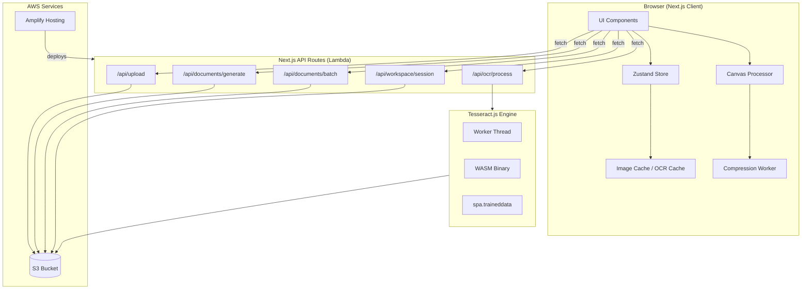
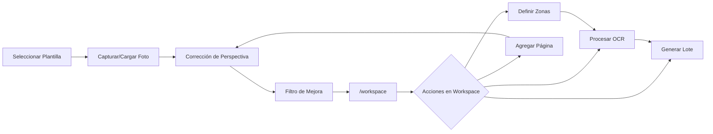

# Design Document: V2 Scanner Optimization

## Overview

Este diseño cubre la segunda versión de la aplicación de digitalización de documentos deportivos. Las mejoras se organizan en cinco pilares:

1. **Optimización de rendimiento**: Compresión inteligente de imágenes, progreso de carga en tiempo real, concurrencia controlada, caché de imágenes y resultados OCR.
2. **Escaneo estilo CamScanner**: Corrección de perspectiva con detección de 4 esquinas, transformación geométrica y filtros de mejora visual (escala de grises, mejora de blancos).
3. **Espacio de Trabajo (/workspace)**: Hub de procesamiento por lotes con gestión de páginas múltiples, definición de zonas de escaneo, asignación de variables y generación batch de documentos.
4. **Migración OCR**: Reemplazo de Amazon Textract por Tesseract.js server-side, manteniendo la misma interfaz `OcrService`.
5. **Despliegue a producción**: Configuración de AWS Amplify para Next.js 14 SSR con compatibilidad Lambda para Tesseract.js (WASM + traineddata).

### Decisiones de diseño clave

- **Tesseract.js server-side**: Se ejecuta en las API Routes (Lambda) usando worker threads con WASM pre-bundled. El archivo `spa.traineddata` se incluye en el deployment package o se carga desde S3 con caché en `/tmp`.
- **Canvas API para procesamiento de imagen**: Corrección de perspectiva y filtros se ejecutan client-side usando HTML5 Canvas + Web Workers para no bloquear UI.
- **Workspace como página única**: `/workspace` es una SPA dentro de la app que gestiona todo el flujo post-captura sin navegación adicional.
- **OCR single-call + filter**: Se mantiene la estrategia existente de una sola llamada OCR por documento completo y filtrado local por BoundingBox.

### Investigación AWS

**AWS Amplify + Next.js 14 SSR** ([docs](https://docs.aws.amazon.com/amplify/latest/userguide/deploy-nextjs-app.html)):
- Amplify detecta Next.js SSR automáticamente cuando `package.json` tiene `"build": "next build"` (sin `next export`).
- Build spec requiere `baseDirectory: .next` y artifacts `'**/*'`.
- Compute resources usan Node.js runtime (`nodejs20.x`, `nodejs22.x`, o `nodejs24.x`).
- Cada compute resource tiene 512 MB de ephemeral storage (`/tmp`), máximo 15 minutos de ejecución, y el bundle uncompressed no puede exceder 220 MB.

**AWS Lambda Limits** ([docs](https://docs.aws.amazon.com/lambda/latest/dg/gettingstarted-limits.html)):
- Memory: 128 MB a 10,240 MB (en incrementos de 1 MB). CPU se asigna proporcionalmente.
- Timeout máximo: 900 segundos (15 minutos).
- Deployment package (.zip): 50 MB comprimido, 250 MB descomprimido.
- `/tmp` storage: 512 MB a 10,240 MB configurable.
- Invocation payload: 6 MB (request/response síncronos).

**S3 CORS** ([docs](https://docs.aws.amazon.com/AmazonS3/latest/userguide/ManageCorsUsing.html)):
- Se configura con `AllowedOrigins`, `AllowedMethods`, `AllowedHeaders`, `ExposeHeaders`, `MaxAgeSeconds`.
- Para presigned URLs se necesitan GET y PUT en AllowedMethods.
- `MaxAgeSeconds: 3000` permite cachear preflight responses.

**Tesseract.js en Lambda**:
- Tesseract.js usa WebAssembly (WASM) internamente. En Node.js, abre worker threads independientes.
- El WASM binary (`tesseract-core`) debe incluirse en el deployment package para evitar descargas en runtime.
- `spa.traineddata` (~30MB) puede bundlearse o cargarse desde S3 y cachearse en `/tmp` para warm invocations.
- Con 1536 MB de memoria Lambda, el worker dispone de ~1 vCPU, suficiente para OCR de documentos individuales.
- Se debe reutilizar el worker entre invocaciones warm para evitar re-inicialización (cold start ~3-5s con traineddata local).

---

## Architecture

### System Architecture Diagram



### Workspace Flow Diagram



---

## Components and Interfaces

### 1. Image Processing Module (Client-Side)

#### `src/utils/imageCompression.ts`

```typescript
interface CompressionOptions {
  maxWidth: number;       // default: 2048px
  maxHeight: number;      // default: 2048px
  quality: number;        // 0-1, default: 0.85
  minDPI: number;         // default: 150
  maxFileSizeMB: number;  // default: 2
}

interface CompressionResult {
  blob: Blob;
  originalSize: number;
  compressedSize: number;
  width: number;
  height: number;
}

export function compressImage(file: File, options?: Partial<CompressionOptions>): Promise<CompressionResult>;
export function shouldCompress(file: File): boolean; // true if > 2MB
```

#### `src/utils/perspectiveCorrection.ts`

```typescript
interface Point { x: number; y: number; }

interface PerspectiveCorrectionResult {
  correctedCanvas: HTMLCanvasElement;
  correctedBlob: Blob;
  transformMatrix: number[];
}

// Detecta bordes del documento usando gradientes de Sobel + Hough transform simplificado
export function detectDocumentCorners(imageData: ImageData): Point[] | null;

// Aplica transformación de perspectiva 4-point
export function applyPerspectiveTransform(
  sourceCanvas: HTMLCanvasElement,
  corners: [Point, Point, Point, Point], // TL, TR, BR, BL
  outputWidth: number,
  outputHeight: number
): PerspectiveCorrectionResult;
```

#### `src/utils/imageFilters.ts`

```typescript
type FilterType = 'none' | 'grayscale' | 'whiteEnhance' | 'grayscaleWhiteEnhance';

interface FilterResult {
  canvas: HTMLCanvasElement;
  blob: Blob;
}

export function applyFilter(
  sourceCanvas: HTMLCanvasElement,
  filter: FilterType
): Promise<FilterResult>;

// Internals
function toGrayscale(imageData: ImageData): ImageData;
function enhanceWhites(imageData: ImageData, threshold?: number): ImageData;
```

### 2. Upload Module (Client-Side)

#### `src/utils/uploadManager.ts`

```typescript
interface UploadProgress {
  fileId: string;
  fileName: string;
  progress: number;     // 0-100
  status: 'pending' | 'uploading' | 'completed' | 'failed' | 'cancelled';
  retryCount: number;
}

interface UploadOptions {
  maxConcurrent: number;  // default: 3
  maxRetries: number;     // default: 3
  onProgress: (progress: UploadProgress[]) => void;
}

export class UploadManager {
  constructor(options?: Partial<UploadOptions>);
  enqueue(file: File, type: 'source'): string; // returns fileId
  cancel(fileId: string): void;
  cancelAll(): void;
  getProgress(): UploadProgress[];
}
```

### 3. Image Cache Module (Client-Side)

#### `src/utils/imageCache.ts`

```typescript
interface CacheEntry {
  url: string;         // object URL or data URL
  s3Key: string;
  cachedAt: number;    // timestamp
  ttlMs: number;       // default: 30 * 60 * 1000 (30 min)
}

export class ImageCache {
  private cache: Map<string, CacheEntry>;

  get(s3Key: string): string | null;        // returns URL or null if expired
  set(s3Key: string, blob: Blob): string;   // stores and returns object URL
  has(s3Key: string): boolean;
  invalidate(s3Key: string): void;
  clear(): void;
}

export const imageCache: ImageCache; // singleton
```


### 4. OCR Cache Module (Client-Side)

#### `src/utils/ocrCache.ts`

```typescript
interface OcrCacheKey {
  documentKey: string;
  areasHash: string; // hash de las areas serializadas
}

export class OcrCache {
  private cache: Map<string, OcrResult[]>;

  generateKey(documentKey: string, areas: AreaOfInterest[]): string;
  get(key: string): OcrResult[] | null;
  set(key: string, results: OcrResult[]): void;
  invalidate(documentKey: string): void;
  clear(): void;
}

export const ocrCache: OcrCache; // singleton
```

### 5. Tesseract.js OCR Service (Server-Side)

#### `src/services/tesseractOcrService.ts`

```typescript
import type { OcrService } from './ocrService';

// Reemplaza TextractOcrService manteniendo la misma interfaz
class TesseractOcrService implements OcrService {
  private worker: Tesseract.Worker | null;
  private isInitialized: boolean;

  constructor();

  // Inicializa worker con WASM + spa.traineddata
  // En Lambda: reutiliza worker entre warm invocations
  private async initialize(): Promise<void>;

  // OcrService interface implementation
  async processDocument(documentKey: string, areas: AreaOfInterest[]): Promise<OcrResult[]>;
  async detectText(imageBytes: Buffer, s3Key?: string): Promise<TextractBlock[]>;
  filterBlocksByArea(blocks: TextractBlock[], area: AreaOfInterest): TextractBlock[];
  calculateAreaConfidence(blocks: TextractBlock[]): number;

  // Convierte output de Tesseract.js a TextractBlock format
  private mapTesseractOutput(
    result: Tesseract.RecognizeResult,
    imageWidth: number,
    imageHeight: number
  ): TextractBlock[];

  // Timeout guard (55 seconds)
  private withTimeout<T>(promise: Promise<T>, timeoutMs: number): Promise<T>;
}

export const ocrService: OcrService; // singleton
```

### 6. Workspace Store Slice

#### Extension de `src/store/useAppStore.ts`

```typescript
interface WorkspacePage {
  id: string;
  pageNumber: number;
  imageS3Key: string;
  imageUrl: string;       // cached local URL
  zones: WorkspaceZone[];
  record: Record<string, string>; // variableName -> extractedText
  ocrProcessed: boolean;
  status: 'pending' | 'processing' | 'completed' | 'error';
}

interface WorkspaceZone {
  id: string;
  x: number; y: number; width: number; height: number; // 0-1
  variableName: string;
  color: string;
}

interface WorkspaceState {
  workspaceActive: boolean;
  activeTemplate: TemplateMetadata | null;
  activeXlsxTemplate: TemplateMetadata | null;
  pages: WorkspacePage[];
  currentPageId: string | null;
  availableVariables: Variable[];
  batchProgress: { current: number; total: number } | null;
  generatedFiles: GeneratedFile[];

  // Actions
  initWorkspace: (template: TemplateMetadata, xlsx?: TemplateMetadata | null) => void;
  addPage: (page: Omit<WorkspacePage, 'pageNumber'>) => void;
  removePage: (pageId: string) => void;
  reorderPages: (fromIndex: number, toIndex: number) => void;
  setCurrentPage: (pageId: string) => void;
  addZone: (pageId: string, zone: WorkspaceZone) => void;
  removeZone: (pageId: string, zoneId: string) => void;
  propagateZones: (fromPageId: string, toAll: boolean) => void;
  updateRecord: (pageId: string, variableName: string, value: string) => void;
  setPageOcrResults: (pageId: string, results: OcrResult[]) => void;
  retakePage: (pageId: string, newImageS3Key: string, newImageUrl: string) => void;
  resetWorkspace: () => void;
  persistToLocalStorage: () => void;
  restoreFromLocalStorage: () => boolean;
}

interface GeneratedFile {
  id: string;
  fileName: string;
  downloadUrl: string;
  type: 'docx' | 'xlsx' | 'zip';
}
```

### 7. New API Routes

#### `POST /api/documents/batch`

```typescript
// Request body
interface BatchGenerateRequest {
  templateId: string;
  xlsxTemplateId?: string;
  records: Array<Record<string, string>>; // one record per page
}

// Response (200)
interface BatchGenerateResponse {
  files: Array<{
    id: string;
    fileName: string;
    downloadUrl: string;
    type: 'docx' | 'xlsx';
  }>;
  zipDownloadUrl: string;
  errors: Array<{ recordIndex: number; message: string }>;
}
```

#### `POST /api/workspace/session` (save) / `GET /api/workspace/session` (restore)

```typescript
// Save request body
interface SaveSessionRequest {
  templateId: string;
  xlsxTemplateId?: string;
  pages: WorkspacePage[];
}

// Save response (201)
{ success: true, sessionId: string }

// GET response (200)
{ session: { templateId, xlsxTemplateId, pages, savedAt: string } }
```

### 8. Workspace UI Components

| Componente | Ubicación | Función |
|-----------|-----------|---------|
| `WorkspacePage` | `src/app/workspace/page.tsx` | Página principal del workspace |
| `PageThumbnailList` | `src/components/workspace/PageThumbnailList.tsx` | Lista scrollable de thumbnails con drag-and-drop |
| `ZoneEditor` | `src/components/workspace/ZoneEditor.tsx` | Canvas para definir zonas (reutiliza CanvasOverlay) |
| `ZoneVariableAssigner` | `src/components/workspace/ZoneVariableAssigner.tsx` | Asignación de variable a zona |
| `BatchResultsTable` | `src/components/workspace/BatchResultsTable.tsx` | Tabla editable de resultados (página × variable) |
| `BatchGeneratePanel` | `src/components/workspace/BatchGeneratePanel.tsx` | Panel de generación con progreso y descargas |
| `PerspectiveEditor` | `src/components/digitization/PerspectiveEditor.tsx` | Editor de 4 esquinas + preview |
| `FilterSelector` | `src/components/digitization/FilterSelector.tsx` | Selector de filtros con preview en tiempo real |
| `UploadProgressBar` | `src/components/ui/UploadProgressBar.tsx` | Barra de progreso para uploads |

---

## Data Models

### Extended Types (`src/types/index.ts`)

```typescript
// ─── Workspace Types ──────────────────────────────────────────────────────────

export interface WorkspacePage {
  id: string;
  pageNumber: number;
  imageS3Key: string;
  imageUrl: string;
  zones: WorkspaceZone[];
  record: Record<string, string>;
  ocrProcessed: boolean;
  status: 'pending' | 'processing' | 'completed' | 'error';
}

export interface WorkspaceZone {
  id: string;
  x: number;
  y: number;
  width: number;
  height: number;
  variableName: string;
  color: string;
}

export interface WorkspaceSession {
  id: string;
  templateId: string;
  xlsxTemplateId?: string;
  pages: WorkspacePage[];
  savedAt: string;
}

export interface GeneratedFile {
  id: string;
  fileName: string;
  downloadUrl: string;
  type: 'docx' | 'xlsx' | 'zip';
}

// ─── Batch Generation Types ───────────────────────────────────────────────────

export interface BatchRecord {
  pageId: string;
  pageNumber: number;
  values: Record<string, string>;
  confidence: Record<string, number>;
  complete: boolean;
}

export interface BatchGenerationResult {
  files: GeneratedFile[];
  zipDownloadUrl: string;
  errors: Array<{ recordIndex: number; message: string }>;
}

// ─── Upload Types ─────────────────────────────────────────────────────────────

export interface UploadProgress {
  fileId: string;
  fileName: string;
  progress: number;
  status: 'pending' | 'uploading' | 'completed' | 'failed' | 'cancelled';
  retryCount: number;
  error?: string;
}

// ─── Image Processing Types ───────────────────────────────────────────────────

export type FilterType = 'none' | 'grayscale' | 'whiteEnhance' | 'grayscaleWhiteEnhance';

export interface Point {
  x: number;
  y: number;
}

export interface PerspectiveCorrectionState {
  corners: [Point, Point, Point, Point]; // TL, TR, BR, BL
  autoDetected: boolean;
  confirmed: boolean;
}
```

### S3 Storage Extensions

```
s3://{S3_BUCKET_NAME}/
├── ... (existing structure) ...
├── sessions/
│   └── {sessionId}.json          # Workspace session state
├── generated/
│   ├── ... (existing) ...
│   └── batch/
│       ├── {batchId}/
│       │   ├── doc_1.docx
│       │   ├── doc_2.docx
│       │   ├── combined.xlsx
│       │   └── batch.zip
└── trained-data/
    └── spa.traineddata            # Tesseract Spanish trained data (fallback)
```

### amplify.yml Build Specification

```yaml
version: 1
frontend:
  phases:
    preBuild:
      commands:
        - npm ci
    build:
      commands:
        - npm run build
        - rm -f node_modules/@swc/core-linux-x64-gnu/swc.linux-x64-gnu.node
        - rm -f node_modules/@swc/core-linux-x64-musl/swc.linux-x64-musl.node
  artifacts:
    baseDirectory: .next
    files:
      - '**/*'
  cache:
    paths:
      - node_modules/**/*
      - .next/cache/**/*
```

### S3 CORS Configuration

```json
[
  {
    "AllowedHeaders": ["*"],
    "AllowedMethods": ["GET", "PUT", "POST"],
    "AllowedOrigins": ["https://*.amplifyapp.com", "http://localhost:3000"],
    "ExposeHeaders": ["ETag", "x-amz-request-id"],
    "MaxAgeSeconds": 3000
  }
]
```

### next.config.mjs Updates

```javascript
/** @type {import('next').NextConfig} */
const nextConfig = {
  output: 'standalone',
  experimental: {
    serverComponentsExternalPackages: ['tesseract.js'],
  },
  webpack: (config, { isServer }) => {
    if (isServer) {
      config.module.rules.push({
        test: /\.wasm$/,
        type: 'asset/resource',
      });
    }
    return config;
  },
};

export default nextConfig;
```

---

## Correctness Properties

*A property is a characteristic or behavior that should hold true across all valid executions of a system — essentially, a formal statement about what the system should do. Properties serve as the bridge between human-readable specifications and machine-verifiable correctness guarantees.*

### Property 1: Compression reduces size while maintaining DPI

*For any* image file larger than 2MB, applying `compressImage` SHALL produce output where `compressedSize < originalSize` AND the effective DPI of the output image is >= 150.

**Validates: Requirements 1.1**

### Property 2: Upload concurrency never exceeds limit

*For any* set of N queued files (N >= 1), at no point during upload processing SHALL more than 3 files have status `'uploading'` simultaneously.

**Validates: Requirements 1.3**

### Property 3: Image cache round-trip

*For any* image stored in the cache with a given s3Key, retrieving that key before TTL expiration SHALL return the same image blob. After TTL expiration, `get(s3Key)` SHALL return `null`.

**Validates: Requirements 1.5, 1.6**

### Property 4: Upload retry with exponential backoff

*For any* upload that fails K consecutive times (K <= 3), the system SHALL retry with delays of 2^K seconds (2s, 4s, 8s). If K reaches 3, the upload SHALL transition to `'failed'` status without further retries.

**Validates: Requirements 1.7**

### Property 5: OCR cache returns identical results

*For any* document key and area set, if OCR has been previously processed for that exact combination, a subsequent request with the same key and areas SHALL return the cached `OcrResult[]` without invoking the OCR engine.

**Validates: Requirements 2.1**

### Property 6: BoundingBox area filtering correctness

*For any* set of TextractBlocks and any AreaOfInterest, `filterBlocksByArea` SHALL return exactly those WORD blocks where `block.left < area.x + area.width AND block.left + block.width > area.x AND block.top < area.y + area.height AND block.top + block.height > area.y`.

**Validates: Requirements 2.2, 2.4, 10.6**

### Property 7: Large file transmission threshold

*For any* file where `size > 5MB` and a valid s3Key exists, the OCR service SHALL use S3Object reference. For any file where `size <= 5MB`, it SHALL transmit bytes directly.

**Validates: Requirements 2.5**

### Property 8: Perspective transform produces valid rectangle

*For any* 4 corner points defining a convex quadrilateral on a source image, `applyPerspectiveTransform` SHALL produce an output canvas with the specified `outputWidth x outputHeight` dimensions without throwing errors.

**Validates: Requirements 3.3**

### Property 9: Grayscale preserves luminance formula

*For any* pixel with RGB values (R, G, B), after applying the grayscale filter, the output pixel SHALL have R = G = B = round(0.299*R + 0.587*G + 0.114*B).

**Validates: Requirements 4.2**

### Property 10: White enhancement increases contrast

*For any* pixel with luminance above the threshold (light areas), applying white enhancement SHALL produce a brighter pixel. For any pixel with luminance below the threshold (dark areas), the output SHALL be equal or darker.

**Validates: Requirements 4.3**

### Property 11: Filter composition equals sequential application

*For any* image, applying `applyFilter('grayscaleWhiteEnhance')` SHALL produce pixel-identical output to applying grayscale first then white enhancement sequentially.

**Validates: Requirements 4.4**

### Property 12: Workspace state persistence round-trip

*For any* valid workspace state (pages, zones, records, template references), serializing to localStorage and deserializing SHALL produce a state deeply equal to the original.

**Validates: Requirements 5.4, 5.5**

### Property 13: Page list maintains sequential numbering

*For any* sequence of page additions, removals, or reorders applied to a workspace, the resulting page list SHALL always have `pageNumber` values forming the sequence 1, 2, 3, ..., N where N is the total page count.

**Validates: Requirements 6.5, 6.6**

### Property 14: Zone propagation preserves positions

*For any* set of zones defined on a source page, propagating to target pages SHALL produce zones on each target page with identical (x, y, width, height, variableName) values as the source.

**Validates: Requirements 6.7, 7.3**

### Property 15: OCR produces exactly one record per page

*For any* workspace with N pages each having M zones, processing OCR SHALL produce exactly N records, each containing exactly M variable entries (one per zone variableName).

**Validates: Requirements 7.5**

### Property 16: Batch generation output count matches records

*For any* batch generation request with N complete records and a Word template, the system SHALL produce exactly N .docx files. When an XLSX template is also provided, the XLSX SHALL contain the original row count plus N new rows.

**Validates: Requirements 8.2, 8.3, 8.8**

### Property 17: Batch generation resilience

*For any* batch of N records where K records fail generation (K < N), the system SHALL still produce (N - K) successful documents and report exactly K errors with their corresponding record indices.

**Validates: Requirements 8.6**

### Property 18: Photo retake preserves zone definitions

*For any* page with defined zones, performing a retake (replacing the image) SHALL preserve all zone definitions (id, x, y, width, height, variableName, color) unchanged while clearing OCR results.

**Validates: Requirements 9.1**

### Property 19: Tesseract output BoundingBox normalization

*For any* image processed by the Tesseract engine, all returned TextractBlocks SHALL have boundingBox values where: 0 <= left <= 1, 0 <= top <= 1, 0 <= width <= 1, 0 <= height <= 1, left + width <= 1, and top + height <= 1. All confidence values SHALL be in range [0, 100].

**Validates: Requirements 10.2, 10.3**

### Property 20: Reading order sort correctness

*For any* array of TextractBlocks, sorting in reading order SHALL produce a sequence where blocks are ordered top-to-bottom (by boundingBox.top), and within blocks on the same line (vertical difference < 0.005), ordered left-to-right (by boundingBox.left).

**Validates: Requirements 10.4**

### Property 21: Worker reuse across warm invocations

*For any* sequence of N OCR processing calls (N > 1) within the same runtime instance, the Tesseract worker SHALL be initialized exactly once (on the first call) and reused for all subsequent calls.

**Validates: Requirements 12.4**

---

## Error Handling

### Client-Side Error Handling Strategy

| Escenario | Accion | Mensaje al usuario |
|-----------|--------|-------------------|
| Upload falla por red | Retry automatico (3 intentos, exponential backoff) | "Error al cargar el archivo. Verifique su conexion e intente nuevamente" |
| Upload cancelado | Abortar XMLHttpRequest | "Carga cancelada" |
| Compresion falla | Usar imagen original sin comprimir | Toast warning: "No se pudo comprimir la imagen. Se usara el archivo original" |
| Deteccion de bordes falla | Colocar esquinas en bordes de imagen | "No se detectaron bordes automaticamente. Ajuste los puntos manualmente" |
| Filtro falla por memoria | Retener imagen sin filtrar | "Error al aplicar el filtro. La imagen es demasiado grande para procesar en el navegador" |
| OCR timeout (55s) | Cancelar y notificar | "Error: el procesamiento OCR excedio el tiempo limite. Intente con una imagen de menor resolucion" |
| Generacion de documento falla (batch) | Saltar registro, continuar | "Error al generar documento para el registro [N]. Los demas documentos se generaron correctamente" |
| LocalStorage lleno | Graceful degradation | Toast warning: "No se pudo guardar el estado. Los datos se perderan al cerrar" |
| Worker Tesseract falla | Error con diagnostico | "Error: no se pudo inicializar el motor OCR. Contacte al administrador" |

### Server-Side Error Handling

Todos los errores de API siguen el formato estandar del proyecto:

```typescript
{
  error: {
    code: string;       // OCR_FAILED, OCR_TIMEOUT, BATCH_PARTIAL, etc.
    message: string;    // Mensaje en espanol para el usuario
    retryable: boolean;
  }
}
```

Codigos de error nuevos:

| Code | HTTP Status | Retryable | Descripcion |
|------|-------------|-----------|-------------|
| OCR_TIMEOUT | 504 | true | Procesamiento excedio 55 segundos |
| OCR_INIT_FAILED | 503 | true | Tesseract worker no pudo inicializarse |
| OCR_FAILED | 500 | true | Error generico durante OCR |
| BATCH_PARTIAL | 207 | false | Algunos registros fallaron en batch |
| BATCH_FAILED | 500 | true | Generacion de lote fallo completamente |
| SESSION_NOT_FOUND | 404 | false | Sesion de workspace no encontrada |
| FILE_TOO_LARGE | 400 | false | Archivo excede limite |
| INVALID_IMAGE | 400 | false | Imagen corrupta o formato no soportado |

---

## Testing Strategy

### Framework and Tools

- **Unit/Integration tests**: vitest (ya configurado en el proyecto)
- **Property-based tests**: fast-check (ya configurado como devDependency)
- **Minimum iterations**: 100 por property test
- **Tag format**: `Feature: v2-scanner-optimization, Property {N}: {description}`

### Property-Based Tests (21 properties)

Cada propiedad del apartado Correctness Properties se implementa como un test con fast-check. Ejemplo:

```typescript
import { fc } from 'fast-check';
import { describe, it, expect } from 'vitest';

// Feature: v2-scanner-optimization, Property 6: BoundingBox area filtering
describe('Property 6: BoundingBox area filtering correctness', () => {
  it('returns exactly those WORD blocks overlapping the area', () => {
    fc.assert(
      fc.property(
        fc.array(arbTextractBlock(), { minLength: 0, maxLength: 50 }),
        arbAreaOfInterest(),
        (blocks, area) => {
          const result = filterBlocksByArea(blocks, area);
          const expected = blocks.filter(b =>
            b.blockType === 'WORD' &&
            b.boundingBox.left < area.x + area.width &&
            b.boundingBox.left + b.boundingBox.width > area.x &&
            b.boundingBox.top < area.y + area.height &&
            b.boundingBox.top + b.boundingBox.height > area.y
          );
          expect(result).toEqual(expected);
        }
      ),
      { numRuns: 100 }
    );
  });
});
```

### Test File Organization

```
src/__tests__/
  properties/
    imageCompression.property.test.ts    # Property 1
    uploadManager.property.test.ts       # Properties 2, 4
    imageCache.property.test.ts          # Property 3
    ocrCache.property.test.ts            # Property 5
    filterBlocksByArea.property.test.ts  # Property 6
    ocrService.property.test.ts          # Properties 7, 19, 20, 21
    perspectiveCorrection.property.test.ts  # Property 8
    imageFilters.property.test.ts        # Properties 9, 10, 11
    workspaceState.property.test.ts      # Properties 12, 13, 14, 18
    batchGeneration.property.test.ts     # Properties 15, 16, 17
  unit/
    tesseractOcrService.test.ts
    uploadManager.test.ts
    workspacePage.test.ts
    batchGeneration.test.ts
  integration/
    ocrApiRoute.test.ts
    batchApiRoute.test.ts
    workspaceSession.test.ts
```

### Unit Tests (Example-Based)

Complementan property tests cubriendo:
- Escenarios UI especificos (skeleton UI, progress bar, drag corners)
- Edge cases (cold start, S3 fallback, memory errors)
- Interacciones de usuario (cancel upload, retake photo, nueva sesion)
- Validaciones de API route contracts (request/response format)

### Integration Tests

- `/api/ocr/process`: Tesseract service invocacion y formato `{ results: OcrResult[] }`
- `/api/documents/batch`: Generacion batch con templates mocked
- `/api/workspace/session`: Ciclo save/restore

### Smoke Tests (Deployment)

- `amplify.yml` estructura correcta
- `next.config.mjs` configuracion standalone + tesseract.js external
- WASM binary presente en build output
- S3 CORS configuration valida
- Lambda memory/timeout correcto (verificacion post-deploy)
